**Մակերևույթնորի եռանկյունացման մոդելների նախագծման ալգորիթմների
մշակում**

**Ներածություն**

Իրական պատկերների ստեղծման ալգորիթմները պետք է ապահովեն մոդելավորված
օբյեկտի հատկությունների փոխանցումը \' ծավալը, գտնվելու վայրը,
կիսատոնային մատուցումը, ստվերները, լուսավորությունը, մակերեսային
հյուսվածքները և այլն: Նման ծավալային պատկերների գեներացումը շատ բարդ
հաշվարկային խնդիր է: Հետևաբար գործնականում ենթարկվում է դեկոմպոզիցիայի․
առարկաները բաժանվում են բաղադրիչ մասերի, եւ ստացված բեկորներից
ձեւավորվում են բարդ պատկերներ: Գործնականում առավել հաճախ կիրառվում է
պատկերների բաժանումը եռանկյունների: Դա պայմանավորված է նրանով, որ
եռանկյունին ամենապարզ բազմանկյունն է, որի գագաթները միանշանակորեն
որոշում են կող: Եռանկյունիներով բաժանման ալգորիթմները էապես ավելի պարզ
են, քան այլ բազմանկյունների դեպքում։ Եռանկյունների բաժանումը զգալիորեն
հեշտացնում է մատուցման ընթացակարգերի իրականացումը։ Եվ վերջապես, ցանկացած
օբյեկտ կարելի է երաշխավորված բաժանել եռանկյունների, ինչը միշտ հնարավոր
չէ այլ բազմանկյունների դեպքում։ Բարդ կառուցվածք ունեցող բազմանկյուն
տարածքի բաժանման գործընթացը եռանկյունների հավաքածուի, կոչվում է
եռանկյունացում։

**Գլուխ 1**

**1.1 Հարթության վրա կետերի բազմության եռանկյունացում**

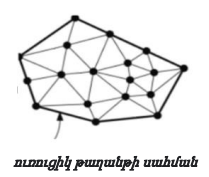{width="1.7418175853018372in"
height="1.4751279527559056in"}Ենթադրենք Р := {р~1~, . . . , р~n~ }
հարթության վրա կետերի բազմություն է։ Նախքան կսահմանենք P-ի
եռանկյունացումը, սահմանենք առավելագույն հարթ տրոհումը որպես այնպիսի S
տրոհում, որին անհնար է ավելացնել գագաթները միացնող կող՝ առանց հարթ
լինելը խախտելու: Այլ կերպ ասած, ցանկացած կող, որը ներառված չէ S-ում,
հատում է գոյություն ունեցող կողերից մեկը։ Այժմ սահմանենք P
եռանկյունացումը որպես առավելագույն հարթ տրոհում, որի համար գագաթների
բազմությունը P-ն է \[1;4\] : Այս սահմանմամբ ակնհայտ է, որ եռանկյունացում
գոյություն ունի: Բայց արդյո՞ք այն բաղկացած է եռանկյուններից: Այո,
յուրաքանչյուր նիստ, բացի անսահմանափակ նիստից, պետք է լինի եռանկյուն.
սահմանափակված նիստը բազմանկյուն է, և ինչպես հայտնի է, ցանկացած
բազմանկյուն կարելի է եռանկյունացնել: Ի՞սկ անսահմանափակ նիստի համար: Հեշտ
է տեսնել, որ ցանկացած հատված, որը միացնում է P ուռուցիկ թաղանթի սահմանին
պատկանող երկու հարևան կետեր,հանդիսանում է ցանկացած 𝒯-ի եռանկյունավորման
կող: Այստեղից հետևում է, որ 𝒯--ի սահմանափակ քանակի նիստերի միավորումը
միշտ հանդիսանում է P-ի ուռուցիկ թաղանթ և, որ անսահմանափակ նիստը
հանդիսանում է ուռուցիկ թաղանթի լրացումն։ (Այս դեպքում դա նշանակում է, որ
եթե որոշման տիրույթը, օրինակ, ուղղանկյուն է, ապա անհրաժեշտ է ներառել նրա
գագաթները ընտրված կետերի բազմության մեջ, որպեսզի եռանկյունացման
եռանկյունները ծածկեն ռելիեֆի ամբողջ որոշման տիրույթը): Եռանկյունների
թիվը նույնն է ցանկացած P եռանկյունացման մեջ։ Նույնը վերաբերում է նաև
կողերի քանակին։ Ճշգրիտ արժեքները կախված են P-ի այն կետերի քանակից, որոնք
ընկած են P-ի ուռուցիկ թաղանթի վրա։ (Այստեղ մենք հաշվում ենք նաև ուռուցիկ
թաղանթի կողերի վրա գտնվող կետերը։ Հետևաբար, ուռուցիկ թաղանթի սահմանի վրա
գտնվող կետերի քանակը պարտադիր չէ, որ համընկնի գագաթների քանակի հետ):

***Թեորեմ 1.1.** Ենթադրենք P-ն հարթության վրա գտնվող n կետերի
բազմություն է, որոնցից ոչ բոլորն են համագիծ, իսկ k-ն՝ P-ի այն կետերի
քանակն է, որոնք գտնվում են P-ի ուռուցիկ թաղանթի սահմանին: Այդ դեպքում
P-ի ցանկացած եռանկյունացում բաղկացած է 2n - 2 - k եռանկյուններից և ունի
Зn - 3 - k կողերը։*

**Ապացույց.**

Ենթադրենք 𝒯-ն P-ի եռանկյունացում է, իսկ m-ը՝ եռանկյունների թիվը 𝒯-ում։
Նկատենք, որ եռանկյունացման կողերի քանակը, որը կնշանակենք nf-ով, հավասար
է m + 1: Յուրաքանչյուր եռանկյուն ունի երեք կող, իսկ անսահմանափակ նիստը՝
k կող: Իսկ յուրաքանչյուր կող կից է ճիշտ երկու նիստերի: Հետեւաբար, 𝒯
կողերի ընդհանուր թիվը հավասար է ne= (3m + k)/2: Էյլերի բանաձևով ՝ n - ne
-nf = 2։ Տեղադրելով այդ բանաձևի մեջ ne և nf արժեքները կստանանք m = 2n- 2
-- k, որտեղից էլ՝ ne = 3n- 3 -- k։

Ենթադրենք 𝒯-ն P եռանկյունացում է՝ կազմված m եռանկյուններից։ Դասավորենք
𝒯-ի եռանկյունների 3m անկյունները աճման կարգով, և թող α1 , α2 ,․․․, α3m
լինի ստացված հաջորդականություն, այսինքն αi ≤ αj, երբ i \< j: Սահմանենք
А( 𝒯) : = (α1 , α2 ,․․․, α3m) 𝒯 --ի անկյունների վեկտոր: Ենթադրենք 𝒯\'-ը
նույն P կետերի մեկ այլ եռանկյունացում է, իսկ А(𝒯\'):= (α1 , α2 ,․․․,
α3m) նրա անկյունների վեկտորը: Կասենք, որ 𝒯-ի անկյան վեկտորը մեծ է 𝒯\'-ի
անկյան վեկտորից, եթե A(𝒯) տվյալ առ տվյալ մեծ է A(𝒯\')-ից, կամ այլ կերպ
ասած եթե գոյություն ունի i ինդեքսը, 1≤i ≤ 3m, այնպիսին, որ

α~j~ = α~j~\' բոլոր j \< i և α ~i~ \> α~i~ \'

Այդ դեպքում կգրենք A(𝒯) \> A(𝒯\'): 𝒯 եռանկյունացումը կոչվում է օպտիմալ
ըստ անկյունների, եթե A(𝒯) ≥ A(𝒯\') P բազմության բոլոր 𝒯\'
եռանկյունացումների համար։
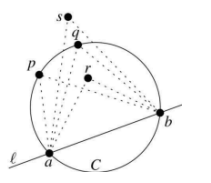{width="1.9215277777777777in"
height="1.6666666666666667in"}\
Ըստ անկյունների օպտիմալ եռանկյունացումները հետաքրքիր են, քանի որ, ինչպես
նշել ենք այս գլխի ներածությունում, դրանք թույլ են տալիս ըստ ընտրված
կետերի բազմության կառուցել բավականին լավ բազմանիստ ռելիեֆ։ Ստորև մենք
կդիտարկենք եռանկյունացումներ, որոնք օպտիմալ են ըստ անկյունների: Նախ
նշենք հետևյալ թեորեմը, որը հաճախ կոչվում է Թալեսի թեորեմ: Նշանակենք
∡pqr-ով p, q, r կետերով կազմված անկյուններից փոքրագույնը:

***Թեորեմ 1.2.** Ենթադրենք C-ն շրջան է, ℓ ուղիղը հատում է C-ն a և b
կետերում, իսկ, p ,q, r և s կետերը ℓ -ի նույն կողմում են: Ենթադրենք, որ
p-ն և q-ն ընկած են C-ի վրա, r-ը C-ի ներսում է, իսկ s-ը՝ C-ից դուրս է:
Այդ դեպքում՝ ∡𝑎𝑟𝑏 \>∡𝑎𝑝𝑏 = ∡𝑎𝑞𝑏\> ∡𝑎𝑠𝑏:*

Այժմ դիտարկենք 𝒯 եռանկյունացման e = pipj կողը։ Եթե e-ն անսահմանափակ
նիստի կող չէ, ապա այն կից է երկու p~i~p~j~p~k~ և p~i~p~j~p~l~
եռանկյուններին։ Եթե այդ եռանկյունները կազմում են ուռուցիկ քառանկյուն,
ապա կարելի է ստանալ նոր 𝒯\' եռանկյունացումը՝ հեռացնելով 𝒯-ի եզրերից pipj
-ն և դրա փոխարեն ավելացնելով pkpl։ Այս գործողությունը կանվանենք կողի
տեղափոխում։ 𝒯 և 𝒯\' անկյան վեկտորները A(𝒯) --ում տարբերվում են միայն վեց
անկյուններով՝ α~1~,․ ․ ․, α~6~ որոնք A(𝒯 \')-ում փոխարինվում են α~1~\'
,․ ․ ․, α~6~\' անկյուններով ։ Սա ցույց է տրված նկ. 1-ում։ e = p~i~p~j~
կողը մենք կանվանենք չթույլատրվող կող։

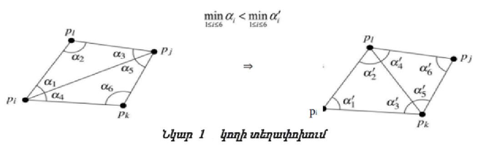{width="5.908333333333333in"
height="1.7861701662292213in"}Այլ կերպ ասած, կողը անվանում են
չթույլատրվող, եթե հնարավոր է լոկալ մեծացնել ամենափոքր անկյունը,
փոխարինելով այդ կողր: Չթույլատրելի կողի սահմանումից անմիջապես բխում է
հետևյալ պնդումը.

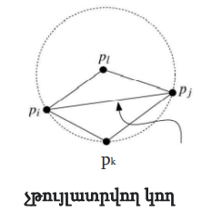{width="2.033333333333333in"
height="2.025in"}***Թեորեմ 1.3.** Ենթադրենք 𝒯-ն չթույլատրվող e կողով
եռանկյունացում է, իսկ 𝒯\'-ը եռանկյունացում է, որը ստացվել է 𝒯--ից՝ e
նետելով։ Այդ դեպքում A(𝒯\') \> A(𝒯 )։ Պարզվում է, որ անհրաժեշտություն
չկա հաշվել α~1~ ,․ ․ ․, α~6~ , α~1~\' ,․ ․ ․, α~6~\' անկյունները ,
որպեսզի ստուգենք այդ կողի թույլատրելիությունը։ Դրա փոխարենը, կարող ենք
օգտագործել մի պարզ հայտանիշ,որը ձևակերպված է հաջորդ լեմմում։ Դրա ճշմարիտ
լինելը հետևում է Թալեսի թեորեմից։*

***Լեմմա 1․1․** Ենթադրենք p~i~p~j~ կողը կից է p~i~p~j~p~k~ և
p~i~p~j~p~l~ եռանկյուններին ,և ենթադրենք C շրջանագիծն, անցնում է p~i~ ,
p~j~ ,p~k~ կետերով։ p~i~p~j~ կողը չթույլատրվող է, այն և միայն այն
դեպքում, երբ p~l~ կետը գտնվում է C -ի ներսում:*

Բացի այդ, եթե p~i~ , p~j~ ,p~k~ , p~1~ կետերը կազմում են ուռուցիկ
քառանկյուն և չեն գտնվում միևնույն շրջանագծի վրա, ապա p~i~p~j~ կամ
p~k~p~1~ կողերից մեկը չթույլատրվող է:\
Նկատենք, որ այդ չափանիշը սիմետրիկ է p~k~ և p~1~-ի նկատմամբ․ p1 գտնվում է
p~i~, p~j~,p~k~ կետերով անցնող շրջանագծի ներսում, այն և միայն այն
դեպքում, եթե p~k~-ն գտնվում է p~i~ , p~j~, p~1~-ով անցնող շրջանագծի
ներսում։ Եթե բոլոր չորս կետերը գտնվում է նույն շրջանագծի վրա, ապա երկու
կողերը P~i~P~j~ և P~k~P~1~ կողերը թույլատրելի են: Նկատենք, որ
չթույլատրող կողին կից երկու եռանկյուններ, պետք է կազմեն ուռուցիկ
քառանկյուն, այնպես, որ չթույլատրվող կողը միշտ կարելի է փոխարինել:
Թույլատրելի ենք անվանում այն եռանկյունացումը, որը չի պարունակում
անթույլատրելի կողեր։ Վերոնշյալ դիտարկումից հետևում է, որ ցանկացած
եռանկյունացումը, որն օպտիմալ է ըստ անկյունների, թույլատրելի է։
Թույլատրելի եռանկյունացումը հաշվարկելը հեշտ է, եթե նախնական
եռանկյունացումը հայտնի է: Պարզապես պետք է տեղափոխել անթույլատրելի
կողերը, մինչև մնան միայն թույլատրելիները:

**LEGAL TRIANGULATION( 𝓣)** ալգորիթմ

Մուտքը։ P կետերի բազմության ինչ-որ 𝒯 եռանյկունացում։

Ելք։ Թույլատրելի P եռանկյունացում ։

1 while 𝒯-ն ունի չթույլատրվող pipj կողը

2 do (տեղափոխել p~i~p~j~ կողը)

3 Ենթադրենք p~i~ p~j~ p~k~ և p~i~p~j~ p~1~ եռանկյուններ են, որոնք կից են
pipj կողով

4 Հեռացնել p~i~ p~j~ -ը 𝒯-ից և դրա փոխարեն ավելացնել pkp1 կողը

5 return 𝒯 Ինչու է այս ալգորիթմը ավարտվում: Թեորեմ 1.3-ից հետևում է, որ
𝒯 անկյան վեկտորը մեծանում է ցիկլի յուրաքանչյուր իտերացիայի վրա: Քանի որ
կա միայն սահմանափակ թվով P-ի տարբեր եռանկյունացումներ, ալգորիթմը պետք է
ավարտվի: Ավարտելուց հետո արդյունքը թույլատրելի եռանկյունացումն է: Չնայած
ալգորիթմը հաստատ ավարտվում է, բայց այն կիրառական նպատակների դեպքում
աշխատում է շատ դանդաղ։ Դա ներկասյացված է միայն նրա համար, որ հետագայում
մեզ պետք է գալու նմանատիպ գործընթաց։ Բայց նախքան այդ դիտարկենք առաջին
հայացքից լրիվ այլ բան թվացող գործողություն։

**1.2 Դելոնեի եռանկյունացում**

Դիցուք P-ն հարթության n կետերի բազմություն է, որոնց հաճախ կանվանենք
կենտրոններ։ Հիշենք որ P բազմության Վորոնովի դիագրամը հարթությունը
բաժանումն է n տիրույթների, յուրաքանչյուրի համար կենտրոնը նույնն է,
այնպես, որ կենտրոնի p ∈ P շրջակայքում են գտնվում հարթության բոլոր
կետերը, որոնց համար p կենտրոնը ամենամոտն է։ P բազմության Վորոնովի
դիագրամը նշանակվում է Vor(P)-ով։ Տիրույթի p կենտրոնը կոչվում է իր
Վորոնովի բջիջ և նշանակվում է V(p): Այս պարագրաֆում մենք կուսումնասիրենք
Վորոնովի դիագրամի երկակի գրաֆը։ Այդ 𝒢 գրաֆում Վորոնովի յուրաքանչյուր
բջիջի համար կա գագաթ (այսինքն՝ յուրաքանչյուր կենտրոնի համար), իսկ երկու
գագաթները միացված են աղեղով, եթե դրանց համապատասխան կետերն
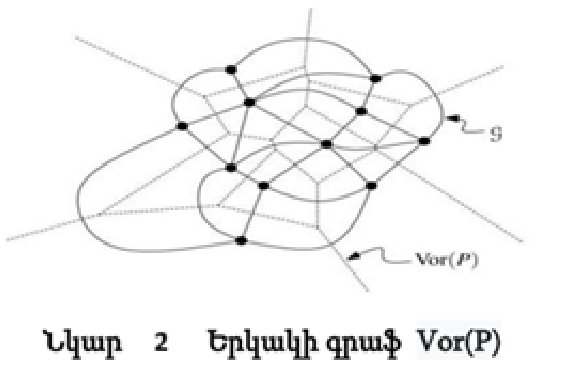{width="2.5416666666666665in"
height="1.7090277777777778in"}ունեն ընդհանուր կող։

Դա նշանակում է, որ 𝒢 գրաֆում յուրաքանչյուր Vor(P) կող ունի աղեղ: Ինչպես
երևում է նկար 2-ում, կա փոխմիարժեք համապատասխանություն 𝒢-ի սահմանափակ
նիստերի և Vor(P)-ի գագաթների միջև:

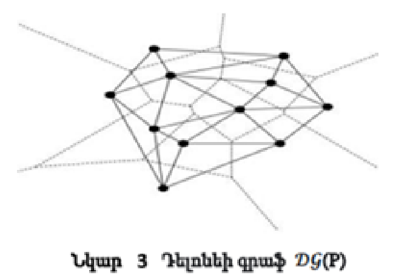{width="2.41875in"
height="1.6388888888888888in"}Դիտարկենք ուղղագիծ 𝒢 շարվածքը, որում
Վորոնովի V(p) բջիջին համապատասխանող գագաթը հանդիսանում է p կետը, իսկ
V(p)-ն և V(q)-ն միացնող աղեղը է հանդիսանում pq հատվածը (տես նկ. 3): Այս
շարվածքը կանվանենք P բազմության Դելոնեի գրաֆ և կնշանակենք 𝒟𝒢 (P):
(Չնայած ազգանունը հնչում է ֆրանսերեն, Դելոնեի գրաֆը ոչ մի կապ չունեի
ֆրանսիացի նկարիչ Դելոնեի հետ, այլ այն անվանվել է ի պատիվ Ռուս
մաթեմատիկոս Բորիս Նիկոլաևիչ Դելոնե։ Նա հրապարակել է իր աշխատանքը
ֆրանսերեն, քանի որ այդ ժամանակ գիտության լեզուները ֆրանսերենն ու
գերմաներենն էին, ուստի նրա անունը հայտնի է ֆրանսերեն տառադարձությամբ,
իսկ անգլերենում այն պետք է գրվի Delone:) Ինչպես պարզվում է, մի շարք
կետերի Դելոնեի գրաֆն ունի մի շարք զարմանալի հատկություններ. Առաջին
հերթին, այս գրաֆը միշտ հարթ է, նրա շարվածքում երկու կողերը չեն հատվում:

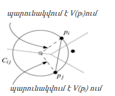{width="1.8979166666666667in"
height="1.5979166666666667in"}***Թեորեմ 1.5** Հարթության կետերով կազմված
Դելոնեի գրաֆը հարթ գրաֆ է։*

**Ապացույց։** Ապացույցի համար մեզ անհրաժեշտ է \[2\] Վորոնովի դիագրամի
եզրային հատկությունը: Պատկերը լրացնելու համար եկեք կրկնենք այն՝
վերափոխելով այն Դելոնեի գրաֆի տերմիններով։ p~i~p~j~ կողը հանդիպում է 𝒟𝒢
(P) գրաֆում, այն և միայն այն դեպքում, եթե կա փակ շրջան C~ij~, այնպես, որ
pi և pj կետերը գտնվում են դրա սահմանի վրա, իսկ ներսում այն չի
պարունակում ոչ մի կետ, որը պատկանում է P-ին (նման շրջանի կենտրոնը
գտնվում է V(p~i~) և V(p~j~) բջիջների ընդհանուր կողը վրա)։

Նշանակենք t~ij~ եռանկյունը, որի գագաթներն են p~i~, p~j~-ն և կենտրոնը՝
C~ij~ ։Նկատի ունենանք, որ t~ij~ կողը, p~i~-ի միացումը C~ij~ կենտրոնի հետ
պատկանում է V(p~i~)։ Նույն կերպ վարվում ենք p~j~ --ի համար։ Թող այժմ
p~k~p~i-~ը մեկ այլ կող է 𝒟𝒢 (P)-ից, սահմանենք C~kl~ շրջանը և եռանկյունի
tkl ինչպես C~ij~ և t~ij~ ։ Ենթադրենք հակառակը, որ p~i~p~j~-ը և p~k~p~l~
ուղիղները հատվում են:\
Այդ p~k~ և p~l~ կողերը պետք է լինեն C~ij~-ից դուրս, հետևաբար նաև
t~ij~-ից դուրս: Այստեղից հետևում է, որ p~k~p~l~ կողը պետք է պատկանի
t~ij~-ին, բայց C~ij~ --ի կենտրոնում հատվում են։
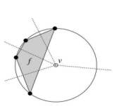{width="1.7270833333333333in"
height="1.5708333333333333in"}Նմանապես, p~i~p~j~ -ը պետք է հատի t~kl~
կողերից մեկը՝ մոտենալով C~kl~ կենտրոնին: Այստեղից հետևում է, որ t~ij~
կողերից մեկը որը համապատասխանում է C~ij~ կենտրոնին, պետք է հատի t~kl~
կողերից մեկը, որը համապատասխանում է C~kl~ կենտրոնին։ Բայց սա հակասում է
այն փաստին, որ այս կողերը գտնվում են ոչ համընկնող Վորոնովի
տիրույթում:\|\
P բազմության Դելոնեի գրաֆը հանդիսանում է Վորոնովի գրաֆի երկակի շարվածք:
Ինչպես արդեն նշել ենք, որ Վորոնովի դիագրամի յուրաքանչյուր գագաթը
համապատասխանում է Դելոնեի գրաֆի նիստին։ Այդ նիստի կողերը համապատասխանում
են Վորոնովի դիագրամի կողերին՝ համապատասխան գագաթին։ Մասնավորապես, եթե
Vor(P)-ի v գագաթը p~1~,p~2~,p~3~,․․․,p~k~ կենտրոններին համապատասխանող
Վորոնովի բջիջների գագաթն է,ապա 𝒟𝒢 (P)-ի համապատասխան նիստի գագաթները
կլինեն p~1~ , p~2~ , p~3~ ,․․․, p~k~ ։ \[2\] --ում բերված թեորեմ
7․4(І)-ից հայտնի է, որ այս իրավիճակում p~1~ , p~2~ , p~3~ ,․․․, p~k~
կետերը գտնվում են v գագաթով կենտրոն ունեցող շրջանագծի վրա,և հետևաբար f-ը
ոչ միայն k-անկյուն է այլ նաև ուռուցիկ։

Եթե P-ի կետերը բաշխված են պատահականորեն,ապա հավանականությունը, որ չորս
կետերը կլինեն նույն շրջանագծի վրա շատ փոքր է։ Այս գլխում մենք կասենք, որ
P բազմության կետերը գտնվում են ընդհանուր դիրքում, եթե դրանցից ոչ մի
չորսը չեն գտնվում նույն շրջանագծի վրա։ Եթե P-ն ընդհանուր դիրքում գտնվող
կետերի բազմություն է, ապա Վորոնովի դիագրամի բոլոր գագաթները ունեն 3
աստիճան, և հետևաբար, 𝒟𝒢 (P)-ի բոլոր սահմանափակ նիստերը եռանկյուններ են։
Սրանովբացատրվում է, թե ինչու են 𝒟𝒢 (P)-ին հաճախ անվանում P բազմության
Դելոնեի եռանկյունացում։ Բայց մենք դեռ 𝒟𝒢 (P)-ն կանվանենք P բազմության
Դելոնեի գրաֆ։ Իսկ Դելոնեի եռանկյունացումը, ցանկացած եռանկյունացում է
,որը ստացվում է Դելոնեի գրաֆին կողեր ավելացնելով։ Քանի որ 𝒟𝒢P)-ի բոլոր
նիստերը ուռուցիկ են նման եռանկյունացում ստանալը հեշտ է։ Նկատի ունենանք,
որ Դելոնեի եռանկյունացումը եզակի է, այն և միայն այն դեպքում, եթե 𝒟𝒢
(P)-ն հանդիսանում է եռանկյունացում՝ այսինքն P-ն ընդհանուր դիրքի կետերի
բազմություն է։ Այժմ ձևակերպենք Վորոնովի դիագրամի հայտնի թեորեմը \[2\]
Դելոնեի գրաֆի տերմիններով։

***Թեորեմ 1․6** Դիցուք P-ն հարթության վրա կետերի բազմություն է։ (І) p~i~
,p~j~ ,p~k~ ∈ P 3 կետերը հանդիսանում են P բազմության Դելոնեի գրաֆի
միևնույն նիստի գագաթները։ Այն և միայն այն դեպքում, երբ P-ով անցնող
շրջանի ներսում չկա p~i~ ,p~j~ , p~k~ -ից ոչ մի կետ։*

*(ІІ) p~i~ ,p~j~ ∈ P 2 կետերը կազմում են P բազմության Դելոնեի գրաֆի կող
այն և միայն այն դեպքում, երբ գոյություն ունի այնպիսի փակ շղթա,որ p~i~
,p~j~ -ն ընկած են դրա սահմանի վրա, իսկ դրա ներսում P-ից ոչ մի կետ չկա։*

Թեորեմ 1․6 ից անմիջապես հետևում է Դելոնեի եռանկյունների հետևյալ
հատկությունը։

***Թեորեմ 1․7** Դիցուք P-ն հարթության վրա կետերի բազմություն է և 𝒯-ն՝
P-ի եռանկյունացումը։ Այնուհետև 𝒯-ն P բազմության Դելոնեի եռանկյունացումն
է, այն և միայն այն դեպքում, երբ շրջանագծի ներսում, որն արտագծած է
կամայական եռանկյանը, չկա P-ի ոչ մի կետ։*

Քանի որ վերևում նշվեց, որ եռանկյունացումը հարմար է բարձրության
ինտերպելացիայի համար, եթե նրա անկյան վեկտորը հնարավորիս մեծ է, ապա մեր
հաջորդ քայլն է ուսումնասիրել Դելոնեի եռանկյունացման անկյունների
վեկտորները։ Դրա համար խոսենք թույլատրելի եռանկյունների մասին։

***Թեորեմ 1․8** Դիցուք P-ն հարթության վրա կետերի բազմություն է։ P
բազմության 𝒯 եռանկյունացումը թույլատրելի է այն և միայն այն դեպքում, երբ
𝒯-ն Դելոնեի եռանկյունացում է։*

**Ապացույց**։\
Սահմանումից անմիջապես հետևում է,որ ցանկացած եռանկյունացում թույլատրելի
է։ Ապացույցը այն բանի, որ յուրաքանչյուր թույլատրելի եռանկյունացում
հանդիսանում է Դելոնեի եռանկյունացում,կկատարենք հակասող
ենթադրությամբ։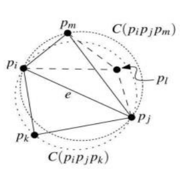{width="2.01875in"
height="1.8534722222222222in"}Ենթադրենք, որ 𝒯-ն P-ի թույլատրելի
եռանկյունացում է, սակայն չի հանդիսանում Դելոնեի եռանկյունացում։ Ըստ
թեորեմ 1․6-ի դա նշանակում է, որ գոյություն ունի այնպիսի p~i~ ,p~j~ ,
p~k~ եռանկյուն, որ արտագծած C(pi ,pj , pk ) շրջանագծի ներսում գտնվում է
ինչ-որ p~l~ ∈ P կետ ։

Դիցուք e:= p~i~ p~j~ -ն pipj pk այնպիսի կողմ է, որ եռանկյունի p~i~ p~j~
p~l~ չի հատվում p~i~p~j~ p~k~ -ի հետ։

Բոլոր( p~i~ ,p~j~ , p~k~, p~l~ )∈ 𝒯-ում ընտրում են այն մեկը որը
մաքսիմումի է հասցնում ∡ p~i~ p~j~ p~l~ -ը։ Այժմ դիտարկենք p~i~ p~j~ p~m~
եռանկյունը, որը կից է p~i~p~j~ p~k~ -ին e կողմի երկայնքով։ Քանի որ 𝒯-ն
թույլատրելի է, ապա e-ն թույլատրելի կող է։ Լեմմա 1․4-ից հետևում է, որ
pm-ը չի գտնվում C(p~i~ p~j~ p~k~ )-ի ներսում։ C(p~i~ p~j~ p~m~ )-ի
շրջանագիծը , որն արտագծած է p~i~ p~j~ p~m~ --ի շուրջ, պարունակում է մաս
C (p~i~ p~j~ p~k~ )-ից՝ առանձնացված p~i~ p~j~ p~k~-ից e կողով։ Հետևաբար
p~l~ ∈ C(p~i~ p~j~ p~m~ )-ին։

Ենթադրենք որ p~i~ p~m~ -ն p~i~ p~j~ p~m~-ի այնպիսի կողմ է, որ p~j~ p~m~
p~l~ չի հատվում p~i~ p~j~ p~m~-ի հետ։ Բայց ըստ Թալեսի թեորեմի ∡
p~j~p~m~p~l~ \> ∡ p~i~p~l~p~j~, որը հակասում է (p~i~, p~j~, p~k~, p~l~ )
զույգի սահմանմանը։ Քանի որ ըստ անկյունների օպտիմալ ցանկացած
եռանկյունացում պետք է թույլատրելի լինի, 1.8 թեորեմից հետևում է, որ P-ի
ցանկացած անկյան օպտիմալ եռանկյունացումը Դելոնեի եռանկյունացում է:

Եթե P կետերը գտնվում են ընդհանուր դիրքում, ապա կա միայն մեկ թույլատրելի
եռանկյունացում, որը, հետևաբար, անկյունների առումով միակ օպտիմալ
եռանկյունացումն է, այն է՝ Դելոնի եռանկյունացումը, որը համընկնում է
Դելոնեի գրաֆիկի հետ։ Եթե P-ի կետերը ընդհանուր դիրքում չեն, ապա
թույլատրելի է Դելոնեի գրաֆիկի ցանկացած եռանկյունացում։ Ոչ բոլոր նման
Դելոնեի եռանկյունացումներն են անկյունային օպտիմալ, բայց դրանց
անկյունային վեկտորները շատ չեն տարբերվում: Ավելին, օգտագործելով Թալեսի
թեորեմը, կարելի է ցույց տալ, որ նույն շրջանագծի վրա գտնվող կետերի
բազմության ցանկացած եռանկյունացման նվազագույն անկյունը նույնն է,
այսինքն, նվազագույն անկյունը կախված չէ եռանկյունացումից: Այստեղից
հետևում է, որ ցանկացած եռանկյունացման համար, որը Դելոնեի գրաֆիկը
վերածում է Դելոնեի եռանկյունացման, նվազագույն անկյունը նույնն է։ Այս
նկատառումների արդյունքներն ամփոփված են հետևյալ թեորեմում.

**Թեորեմ 1.9** *Դիցուք P-ն հարթության կետերի բազմություն է: Ըստ
անկյանների օպտիմալ յուրաքանչյուր P եռանկյունացում հանդիսանում է Դելոնեի
եռանկյունացում: Ավելին,Դելոնեի ցանկացած եռանկյունացում առավելագույնի է
հասցնում նվազագույն անկյունը բոլոր P եռանկյունացումների համար*

**Մակերևույթների և մարմինների եռանկյունացում**

Եռանկյունացումը նրանից ոչ հեռու գտնվող մոդելավորված օբյեկտի մակերևույթի
մոտարկումն է եռանկյուն թիթեղների միջոցով՝ որոնք դրանից գտնվում են տրված
𝛿 մեծությունը չգերազանցող հեռավորության վրա։ Բոլոր եռանկյուն թիթեղները
պետք է միացվեն միմյանց հետ։ Նրանց գագաթները ընկած են մակերևույթի վրա:
Եռանկյուն թիթեղների հավաքածուի հետ ավելի հեշտ է աշխատել, քան ընդհանուր
տեսքի մակերևույթներով: Եռանկյուն թիթեղները կանվանենք եռանկյուններ:
Եռանկյան համար հեռավորությունը տվյալ կետից կամ տարածության մեջ ուղղի հետ
հատման կետից բավականին արագ կարելի է հաշվարկել: Նիստերի եռանկյունացումը
կատարվում է երկրաչափական մոդելի տեսողական ընկալման համար, ուստի
եռանկյունների կողմերն ընտրվում են այնպես, որ աչքը չկարողանա նկատել
կոտրվածքները։

Մակերևույթների պարամետրական հարթությունների վրա երկրաչափական օբյեկտների
եռանկյուններով արտապատկերման ժամանակ,պետք է կառուցվի մարմնի նիստերի
տարածական եռանկյունացում՝ տարածության մեջ 𝑝~i~\[u~i~, v~i~\] կետերի
զանգվածի և այդ կետում մարմնի նիստերի mi\[ui,vi\] նորմալների զանգվածի
հաշվման ճանապարհով՝ ըստ 𝑝~i~= \[u~i~ v~i~\] ^T^ երկրաչափական կետերի
զանգվածի։

Մարմինները արագ արտապատկերման համար, դրանց նիստերը մոտարկվում են
եռանկյուն թիթեղներով՝ կառուցված 𝑝~i~ կետերի վրա: Նորմալները պահանջվում
են մարմնի նիստերի հետ փոխազդող լույսի ճառագայթների վարքագիծը որոշելու
համար: Մակերույթի եռանկյունացման արդյունքում մենք ցանկանում ենք
պարամետրական հարթության վրա ունենալ 𝑝~i~= \[u~i~ v~i~\] T կետերի երկչափ
զանգված և ամբողջ թվերի եռյակների զանգված, որոնք հանդիսանում են առաջինը
նշված զանգվածում կետերի համարներին: Այսպիսով, յուրաքանչյուր եռանկյուն
կներկայացվի (պարամետրական զանգվածում) իր երեք գագաթների համարներով:
Պարամետրական տիրույթի յուրաքանչյուր երկչափ կետի համար կարելի է հաշվել
մակերևույթի վրա 𝑝~i~(u~i~, v~i~) տարածական կետը և այդ կետում
մակերևույթների m~i~(u~i~, v~i~) կետը: Տարածական կետերը և նորմալները
կարող են պահպանվել զանգվածներում,որոնք նման են երկչափ կետերի զանգվածին:\
Անդրադառնանք եռանկյունացման որոշ մեթոդների վրա: Հարթ մակերևույթների
համար կան եռանկյունացման տնտեսական մեթոդներ, որոնցում եռանկյունները
կառուցված են մակերևույթի սահմանային կետերի վրա և չի պահանջվում ճշգրիտ
պարզել պարամետրական տիրույթի ներսում գտնվող կետերը: Դելոնեի
եռանկյունացում։ Քննարկենք հարթության վրա ինչ-որ տիրույթ։ Այդ տիրույթը
կկոչվի ուռուցիկ, եթե դրա սահմանով շարժվելիս ստիպված լինենք պտտվել միայն
մեկ ուղղությամբ (միայն ձախ կամ միայն աջ):

Ուռուցիկ հարթ տիրույթների եռանկյունացման համար կարելի է օգտագործել
Դելոնեի ալգորիթմը: Մենք չենք կարող կիրառել այս ալգորիթմը ուղղակիորեն
կամայական ձևի մակերևույթների եռանկյունացման համար, բայց մենք
կօգտագործենք նրա եռանկյունների կառուցման մեթոդը։ Դիցուք տրվածք է ինչ-որ
ուռուցիկ երկչափ տիրույթ, որը սահմանափակված է փակ բեկյալով, և ներսում
գտնվող կետերի 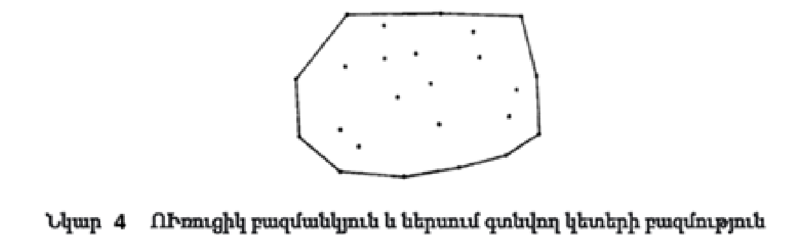{width="4.677083333333333in"
height="1.4304429133858267in"}բազմությունով(նկ. 4):

Պահանջվում է տրված տիրույթը տրոհել եռանկյուններ, որոնց գագաթները նշված
տիրույթի կետերն են և տիրույթը սահմանափակող փակ բեկյալի գագաթները։
Եռանկյունները չպետք է ծածկեն միմյանց,իսկ դրանց կողմերը եթե հատվում
են,ապա հատվում են միայն գագաթներով։ Հնարավոր է կառուցել եռանկյունների մի
քանի տարբեր խմբեր, որոնք լրացնում են տվյալ տարածքը։ Բոլոր դեպքերում,
եռանկյունների թիվը հավասար է K+I-2-ի, որտեղ K-ն սահմանափակող բեկյալի
գագաթների թիվն է, I-ը տիրույթի ներսում տրված ճշգրիտ կետերի թիվը:
Տիրույթի եռանկյունացումը հենց կլինի Դելոնեի եռանկյունացում, եթե
յուրաքանչյուր եռանկյան շուրջ արտագծված շրջանագծի ներսում այլ եռանկյան
գագաթ չկա։

Դելոնեի եռանկյունացումը կառուցում է եռանկյուններ որքան հնարավոր է մոտ
անկյուններով (թույլ չի տալիս կառուցել անտեղի ձգված եռանկյուններ):

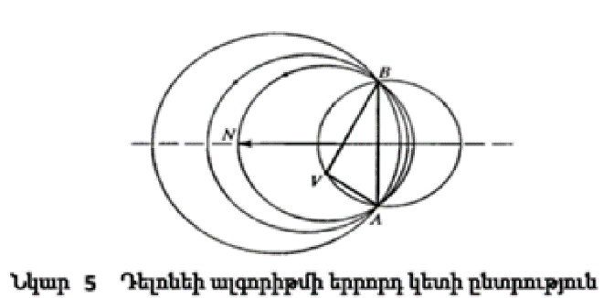{width="3.0541666666666667in"
height="1.4819444444444445in"}Մենք կարող ենք այն անվանել հավասարակշռված:
Դելոնի եռանկյունացումը եզակի կլինի, եթե չկան չորս կետեր, որոնք գտնվում
են մեկ շրջանագծի վրա։

Դիտարկենք Դելոնեի եռանկյունացումը: Տիրույթը սահմանափակող բեկյալի
գագաթները և տիրույթի ներսում տրված կետերը կկոչվեն եռանկյունացման
գագաթներ։ Եռանկյունների կողմերը կկոչվեն կողեր: Կողերից ընտրում ենք
սահմանափակող տիրույթի հատվածները, որոնք կանվանենք սահմանային կողեր։
Դասավորենք բոլոր սահմանային կողերը այնպես,որ ուռուցիկ տիրույթն ընկնի
յուրաքանչյուր կողից ձախ: Ենթադրենք պահանջվում է կառուցել եռանկյուն, որի
կողը AB սահմանային կողն է, որը ցույց է տրված նկ. 5։

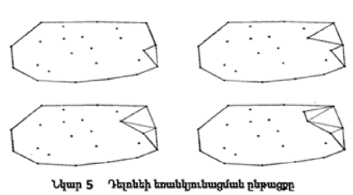{width="2.7354166666666666in"
height="1.5125in"}Շրջանագիծ կարելի է գծել A, B գագաթներով և ցանկացած
գագաթով, որը չի գտնվում նրանց հետ նույն ուղղի վրա: Որպես եռանկյան երրորդ
գագաթ Ընտրվում է այն V գագաթը, որին համապատասխան շրջանագիծն այլ գագաթ չի
պարունակում, բացի AB հատվածի նկատմամբ միևնույն կողմի գագաթներից, որտեղ
գտնվում է V կետը: Ընդհանուր դեպքում, սահմանային կողի համար կարելի է
գտնել այդպիսի մեկ գագաթ:

Այն կանվանենք մոտակա կետ: A, B և V կետերով անցնող շրջանագծի կենտրոնը
գտնվում է AB, BV և VA հատվածների միջնուղղահայացների հատման կետում:
Շրջանագծի կենտրոնի դիրքը բնութագրվելու է MN հատվածի t պարամետրով՝ AB
կողին ուղղահայաց,որը հավասար է նրա հետ ըստ երկարության և անցնում է AB
կողի միջնակետով։

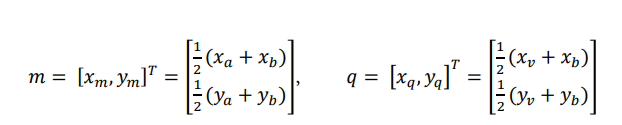{width="4.3602941819772525in"
height="0.8762653105861767in"}AB -- ից ձախ գտնվող բոլոր գագաթների համար
մոտակա գագաթն ունի ամենափոքր t պարամետր։ Մոտակա գագաթին համապատասխանող
շրջանագիծը չի պարունակում ուրիշ գագաթներ AB հատվածից ձախ։ Դիցուք A, B, V
գագաթները նկարագրվում են երկչափ 𝑎 = \[𝑥~𝑎~, 𝑦~𝑎~\] , 𝑏 = \[𝑥~𝑏~, 𝑦~𝑏~\]
^𝑇^ , 𝑣 = \[𝑥~𝑣~, 𝑦~𝑣~\] ^𝑇^ համապատասխան միավոր վեկտորներով։ AB և BV
հատվածների միջնակետերի շառավիղ վեկտորները հավասար են՝

MN=(1-t)m+tn ուղղի 𝑡 պարամետրի արժեքը, որը համապատասխանում է B և V
կետերով անցնող շրջանագծի կենտրոնին հավասար է՝

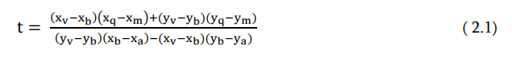{width="3.51875in" height="0.55in"}(1.1)

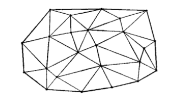{width="2.29375in"
height="1.3444444444444446in"}AB հատվացի ձախ կողմի մոտակա գագաթի համար t
պարամետրը ընդունում է նվազագույն արժեքը։ Բոլոր սահմանային կողերը
կողմնորոշենք այնպես, որ եռանկյունացվող տիրույթն ընկնի դրանցից
յուրաքանչյուրի ձախ կողմում։ Մենք սկսում ենք եռանկյուններ կառուցել
ցանկացած սահմանային կողից։ Եկեք նրա համար գտնենք մոտակա գագաթը, որի
համապատասխան շրջանագիծը չի պարունակում այլ գագաթներ։ Դիցուք AB
սահմանային կողի համար գտնվել է մոտակա V գագաթը։ Այդ դեպքում կառուցենք
ABV եռանկյունը և AB կողն այլևս չենք օգտագործի։ Մենք կանվանենք ոչ ակտիվ
կողեր և գագաթներ նրանց, որոնք չեն մասնակցում եռանկյունացման ալգորիթմին։
Եթե սահմանային կողերի մեջ չկա BV կողը, ապա մենք կառուցում ենք նոր
սահմանային կողը VB հատվածի վրա։ Եթե սահմանային կողի մեջ կա BV կողը ապա
այն և B գագաթը տեղափոխում ենք ոչ ակտիվների կատեգորիա։ Եթե սահմանային
կողի վրա չկա VA, ապա AV հատվածի վրա մենք կառուցում ենք նոր սահմանային
կող։ Եթե սահմանային կողի մեջ կա VA կող, ապա այն և A գագաթը տեղափոխում
ենք ոչ կուտակային կատեգորիա։ Եռանկյունացման ընթացքը ցույց է տրված 2․12
նկարում։ Եռանկյունացումն ավարտվում է, երբ բոլոր գագաթներն ու կողերն
դառնում են անգործուն։ Տվյալ տիրույթի եռանկյունացման արդյունքը
ներկայացված է նկար 7-ում։

> ***Նկ 7. Դելոնեյի եռանկյուացում***

*Եռանկյունացման ուղղման մեթոդը։ Դիտարկենք եռանկյունաձև 𝓊~min~≤ 𝓊 ≤
𝓊~max~ ,*

𝜐~min~≤ 𝜐 ≤ 𝜐~max~ պարամետրերով որոշման տիրույթով ինչ-որ r(u,v)
մակերևույթի եռանկյունացում։ Այժմ մակերևույթի պարամետրերի որոշման
տիրույթը բաժանենք ուղղանկյուն բջիջնրի երկչափ գծերով 𝓊~i~ =const և 𝜐~j~
=const i=1.2...m, j=1,2,...n: Այս տողերը կազմում են ուղղանկյուն ցանց։
Պարամետրական ∆ 𝓊~i~ = 𝓊~i+1~- 𝓊~i~ հեռավորությունները 𝓊~i~

=const կից գծերի միջև համաձայն հայտնի բանաձևի, վերցնենք հավասար՝

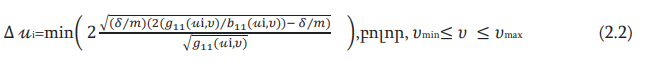{width="4.85in" height="0.55in"}Պարամետրական ∆
𝜐~i~ = 𝜐~i+1~- 𝜐~i~ հեռավորությունը 𝜐~j~ =const կից գծերի միջև վերցնենք
հավասար՝

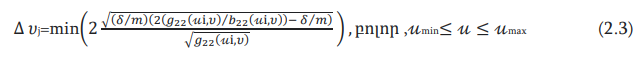{width="4.872222222222222in"
height="0.575in"}(1.2)

(1.3)

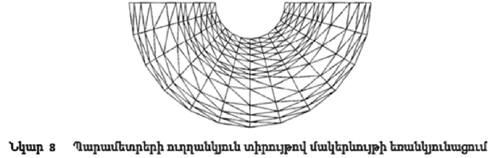{width="4.898611111111111in"
height="1.5770833333333334in"}Բոլոր ուղղանկյուն վանդակներում կառուցենք
շեղանկյուններ, կստանանք մակերեսի եռանկյունացում (կստանանք տվյալ
պահանջներին բավարարող եռանկյունների հավաքածու)։ Նկ․8-ում ներկայացված է
փոփոխություն եռանկյունացման նկարագրված ձևով։ Դիտարկենք կամայական
սահմանագծով r(u,v) մակերևույթի եռանկյունացում։ Եռանկյունացման մեթոդը
կառուցենք պարամետրերի ուղղանկյունաձև որոշման տիրույթով մակերևույթի վերը
նկարագրված եռանկյունացման սահմանային կոնտուրների ճշգրտման միջոցով։

Դիցուք մակերևույթի սահմանը պարամետրերի սահմանման տիրույթում նկարագրվում
է մի քանի չհատվող երկչափ ուրվագծերով: Եզրագծերից մեկը արտաքին է և
պարունակում է մնացած եզրագծերը։ Որպես դրական ուղղություն յուրաքանչյուր
ուրվագծի համար, մենք վերցնում ենք այն ուղղությունը, որով շարժվելիս
մակերևույթի սահմանման տարածքը միշտ գտնվում է եզրագծի ձախ կողմում, եթե
նայում եք մակերևույթի նորմալի ուղղությամբ: Մակերևույթի որոշման տիրույթի
սահմանային ուրվագծերի դրական ուղղությամբ կառուցենք բազմանկյուններ։
Սահմանային բազմանկյուններ կառուցելու համար անհրաժեշտ է որոշակի փոփոխական
քայլով անցնել մակերևույթի սահմանային ուրվագծերով և լրացնել երկչափ կետերի
զանգված, որոնց կոորդինատներն են մակերևույթի պարամետրերը։ Բազմանկյունը
կառուցելու ենք պարամետրական հարթության կետերից, բայց մի կետից մյուսը
անցման քայլը կորոշվի տարածական երկրաչափությունից, ավելի կոնկրետ այն
պայմանից, որ կից կետերի միջև կորի աղեղի շեղումն չի լինի ավելի քան տրված
𝛿 արժեքը։ Մակերևույթի սահմանային եզրագծի (𝑡) = 𝑟(𝑢(𝑡), 𝑣(𝑡)) կորի համար
բազմանկյուն կառուցելու ∆𝑡 պարամետրական քայլերը հաշվարկվում են հայտնի
բանաձևով.

Յուրաքանչյուր բազմանկյուն բաղկացած է երկչափ կետերի դասավորված
բազմությունից 𝑝~𝑖~ = \[𝑢 , 𝑣~𝑖~ \] ^𝑇^ : Բազմանկյան յուրաքանչյուր հատված
կարելի է դիտարկել որպես երկու հարակից կետերի վրա կառուցված երկչափ ուղիղ
գծի հատված։ Նման հատվածները մենք կօգտագործենք որպես սահմանային կողեր,
իսկ այն բազմանկյունների կետերը, որոնց վրա հիմնված են կողերը, որպես
եռանկյունացման գագաթներ: Քանի որ մակերևույթի պարամետրերի որոշման
տիրույթը գտնվում է սահմանային բազմանկյունների ձախ կողմում,ապա
եռանկյունների կառուցման ժամանակ եռանկյունացման յուրաքանչյուր սահմանային
կողի համար եռանկյան երրորդ գագաթը հարկ է փնտրել կողից ձախ:

Այնուհետև կառուցուենք ուղղանկյուն ցանց 𝑢~𝑚𝑖𝑛~ ≤ 𝑢 ≤ 𝑢~𝑚𝑎𝑥~, 𝑣~𝑚𝑖𝑛~ ≤ 𝑣 ≤
𝑣~𝑚𝑎𝑥~ տիրույթի համար, որտեղ 𝑢~𝑚𝑖𝑛~, 𝑢~𝑚𝑎𝑥~, 𝑣~𝑚𝑖𝑛~, 𝑣~𝑚𝑎𝑥~-ը որոշում են
արտաքին սահմանի եզրագծի ընդհանուր ուղղանկյունը: Մենք նաև կօգտագործենք
ցանցային հանգույցները որպես եռանկյունացման գագաթներ: Եկեք որոշենք, թե որ
հանգույցներն են գտնվում սահմանային բազմանկյունների ներսում, և որոնք են
գտնվում եզրագծի վրա կամ մակերևույթի որոշման տիրույթից դուրս:
Օգտագործելով այս տեղեկատվությունը, մենք ուղղանկյուն ցանցի բջիջները
դասավորում ենք երկու խմբի: Առաջին խումբը ներառում է բջիջներ, որոնք
ամբողջությամբ գտնվում են մակերևույթի պարամետրերի որոշման տիրույթում
(բջիջները չպետք է շոշափման սահմանային բազմանկյունները): Երկրորդ խումբը
ներառում է մնացած բջիջները (որոնք ընկած են մակերևույթի որոշման
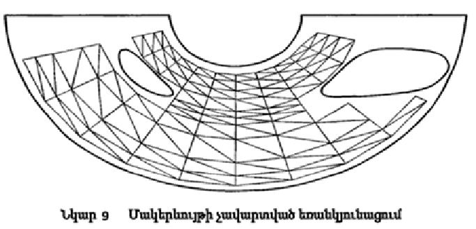{width="3.1631944444444446in"
height="1.523611111111111in"}տիրույթից դուրս, կամ հատվում են սահմանային
բազմանկյուններով):

Առաջին խմբի յուրաքանչյուր բջիջի ներսում, օգտագործելով անկյունագիծեր,
կառուցենք երկու եռանկյուն: Այսպիսով, մենք ստանում ենք չանավարտված
եռանկյունացում: Եզրագծերով սահմանափակված փոփոխության մակերևույթի համար
առաջին խմբի բջիջներում եռանկյուններ կառուցելու օրինակը ներկայացված է
նկ.9: Երկրորդ խմբի բջիջների չհատված կողերի վրա կառուցենք սահմանային
կողեր և դրան ուղղորդենք այնպես, որ համապատասխան բջիջը գտնվում է կողից
ձախ։ Առաջին խմբի բջիջների շուրջ կառուցենք փակ բեկյալ գիծ (հնարավոր է մի
քանի փակ գծեր), այնպես որ դրա երկայնքով շարժվելիս տիրույթի այն մասը, որը
բաժանված չէ եռանկյունների, ընկած է ձախ կողմում, եթե նայենք դեպի
մակերևույթի նորմային հանդիպակաց: Այդ բեկյալ գծի ուղղագիծ մասերը ևս
կօգտագործենք որպես սահմանային կողեր: Մենք կհամարենք բոլոր կողերը հավասար
իրավունքներով։ Եռանկյունացումն ավարտելու համար մենք պետք է եռանկյուններ
կառուցենք սահմանային կողերի միջև: Յուրաքանչյուր կողի համար մենք կփնտրենք
գագաթ, որը գտնվում է դրա ձախ կողմում և կարող է օգտագործվել եռանկյուն
կառուցելու համար: Մենք կփնտրենք գագաթներ միայն այն գագաթների մեջ, որոնք
գտնվում են կողի հետ միևնույն բջիջում: Գագաթն ընտրելու համար մենք
օգտագործում ենք վերևում նկարագրված Դելոնեի մեթոդը, որը պատկերված է նկ.
2․11։ Եթե նման գագաթ գտնվի, ապա պետք է ստուգել, թե արդյոք եռանկյան երկու
նոր կողերը հատվում են մեկ այլ սահմանային կողի հետ: Դիցուք AB սահմանային
կողի համար գտնվի մոտակա V գագաթը, որը պետք է ստուգել, որ BV և V A
հատվածները չեն հատում այլ սահմանային կողեր: Այնուհետև կառուցում ենք ABV
եռանկյուն և AB կողը վերածում ոչ ակտիվ վիճակի։ Եթե սահմանային եզրերի մեջ
չկա BV կողր, ապա V B հատվածի վրա կառուցում ենք նոր սահմանային կողր, իսկ
եթե սահմանային կողերի մեջ կա BV կողը, ապա այն և B գագաթը փոխակերպում ենք
ոչ ակտիվների կատեգորիայի: Եթե սահմանային եզրերի մեջ չկա VA կողը, ապա AV
հատվածի վրա մենք կառուցում ենք նոր սահմանային կող, իսկ եթե սահմանային
կողերի մեջ կա VA կող, ապա այն և A գագաթը տեղափոխում ենք ոչ ակտիվների
կատեգորիա: Եթե BV կամ VA հատվածը հատում է այլ սահմանային կողեր, ապա մենք
անցնում ենք մեկ այլ սահմանային եզրի մոտակա գագաթի որոնմանը:
Եռանկյունացումը կավարտվի

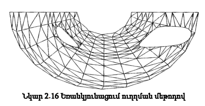{width="3.5166666666666666in"
height="1.5770833333333334in"}բոլոր կողերն ու գագաթները ոչ ակտիվ
կատեգորիային փոխելուց հետո:

> ***նկ 10 Եռանկյունացում ուղղման մեթոդով***

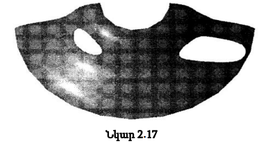{width="3.3319444444444444in"
height="1.61875in"}Նկ.10-ը ցույց է տալիս մակերևույթի եռանկյունացումը
սահմանային ուրվագծերով հատված վանդակներում եռանկյունների ուղղման
մեթոդով։ Նկ.11 ստացված եռանկյունացման օգնությամբ ցուցադրվում է ինքնին
մակերեսը։

> ***նկ 11***

Եթե սահմանային բազմանկյունները և մակերևույթը ունեն որոշակի
համաչափություն, ուղղման մեթոդով եռանկյունացումը կունենա նմանատիպ
համաչափություն:

*Եռանկյունացում կլանման մեթոդով։* Դիտարկենք եռանկյունացման մեկ այլ
մեթոդ: Արագությամբ զիջում է Դելոնեի եռանկյունացմանը և նրա
մոդիֆիկացիաներին։ Եռանկյունացման ընթացակարգը սկսելու համար անհրաժեշտ է
մակերևույթի սահմանը ներկայացնել փակ բազմանկյունների տեսքով։
Եռանկյունացման գործընթացում մենք պետք է որոշենք քայլերը ըստ մակերեսի ∆ 𝑢
և ∆𝑣 պարամետրերի: Շարժման հայտնի ուղղության դեպքում այս քայլերը որոշվում
են հայտնի բանաձևերով: Մոտավորապես, ∆ 𝑢 և ∆𝑣 մակերևութային պարամետրերի
քայլերը կարելի է գտնել հետևյալ կերպ։ Որոշենք պարամետրային հարթության վրա
որոշակի \[𝑢~0~ , 𝑣~0~\] ^𝑇^ կետի շրջակայքը այնպես, որ ցանկացած տարածական
հատված \[𝑢~0~ , 𝑣~0~\] ^𝑇^ կետից մինչև \[𝑢~1~ , 𝑣~1~\] ^𝑇^ կետը բաժանվի
մակերեսից: ոչ ավելի, քան տրված արժեքը 𝛿: Դա անելու համար մենք հաշվարկենք
պարամետրերի թույլատրելի աճերը կոորդինատային գծերի երկայնքով,

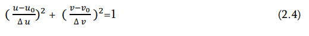{width="2.1006944444444446in"
height="0.5159722222222223in"}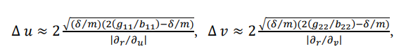{width="4.80875in"
height="0.6667246281714786in"}որտեղ 𝑔~11~, 𝑔~22~, 𝑏~11~, 𝑏~22~
մակերևույթի առաջին և երկրորդ քառակուսի ձևերի գործակիցներն են հենց \[𝑢~0~
, 𝑣~0~\] ^𝑇^ կետում: Որպես փնտրվող տիրույթի սահման ընդունենք ∆ 𝑢 և ∆𝑣
կիսաառանցքներում և\[𝑢~0~ , 𝑣~0~\] ^𝑇^ կետում կենտրոն ունեցող էլիպս: Այդ
էլիպսի հավասարումը ունի հետևյալ տեսքը

> (1.4)

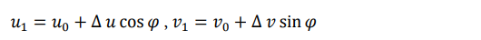{width="3.5236111111111112in"
height="0.36666666666666664in"}Եթե հարթության վրա պահանջվում է գտնել
\[𝑢~0~ , 𝑣~0~\] ^𝑇^ կետի մոտ 𝑢 առանցքի հետ 𝜑 անկյունը կազմող ուղղության
վրա կետ, ապա դրա պարամետրերը կլինեն\`

> (1.5)

Նախ դիտարկենք ավելի պարզ դեպք, երբ մակերևույթի պարամետրերի տիրոիյթի
սահմանափակվում է մեկ արտաքին եզրագծով: Մակերեւույթի սահմանը մոտարկենք
փակ բազմանկյունով (պարամետրային տիրույթի վրա) ։ Եռանկյունացման
կառուցելիս կօգտագործենք աշխատանքային բազմանկյուն, որի համար այս դեպքում
կվերցնենք արտաքին եզրագծի բազմանկյունը։ Բազմանկյան կետերը ներառենք
երկչափ կետերի արդյունարար զանգվածում։Եռանկյունները կառուցվում են սկսած
աշխատանքային բազմանկյան եզրից,նեղացնելով այն այնքան ժամանակ,քանի
աշխատանքային բազմանկյան վրա կմնա ընդամենը երեք կետ։ Գտնենք աշխատանքային
բազմանկյան այն գագաթը, որով այն պտտվում է տիրույթի ներսում: Նման կետ
միշտ գոյություն ունի, և դրա պտտման անկյունը 𝜋-ից փոքր է։ Այդ կետը
նշանակենք 𝜊-ով, իսկ դրա պարամետրերը՝𝑢 , 𝑣~𝜊~ : Այդ կետի մոտ կկառուցենք
մեկ կամ երկու եռանկյուն՝ կախված պտտման անկյունից: Եթե անկյունը փոքր է 𝜋
/2-ից, ապա այդ երեք կետերի վրա կկառուցենք մեկ եռանկյուն։ Հակառակ դեպքում
տրվածի վրա կկառուցենք երկու եռանկյուն, երկու հաևան և մեկ նոր կետերով(նկ.
14): Նոր կետը նշանակվում է P-ով: P կետը պետք է փնտրել BOCP զուգահեռագծի
անկյունագծի վրա: Եթե զուգահեռագծի գագաթն ընկած է էլիպսի ներսում (նկ.
13), ապա այն ընդունում ենք որպես P կետ: Հակառակ դեպքում,P կետը վերցնում
ենք էլիպսի և զուգահեռագծի անկյունագծի հատումը: Վերջին դեպքում ամենևին էլ
պետք չէ փնտրել էլիպսի և հատվածի հատումը։

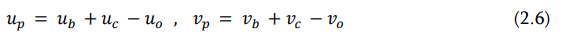{width="3.2678576115485565in" height="0.35in"}Р
կետի 𝑢~𝑝~ և 𝑣~𝑝~ կոորդինատները որոշվում են ОВС կետերի կոորդինատների
միջոցով

> (1.6)

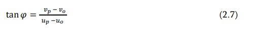{width="2.11875in"
height="0.5666666666666667in"}OР հատվածի անկյունը հորիզոնականի հետ
որոշվում է հետևյալ հավասարությամբ՝

> (1.7)

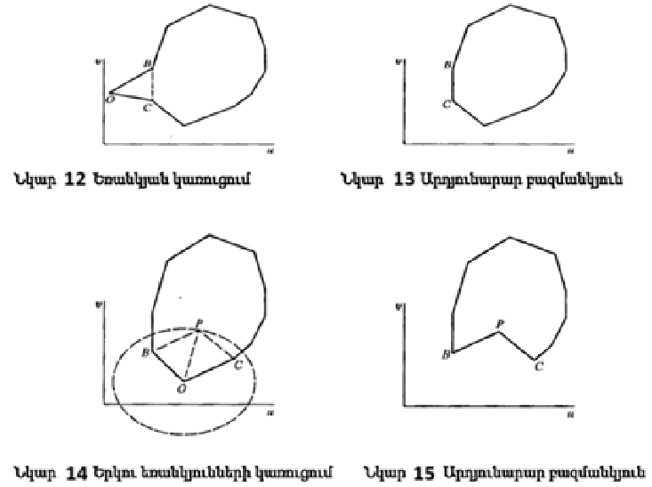{width="2.935416666666667in"
height="2.1902777777777778in"}Այս տվյալները թույլ են տալիս որոշել P կետի
դիրքը էլիպսի նկատմամբ (1.4): Նկ. 12-ում պատկերված դեպքում կառուցենք
եռանկյուն (հիշենք նրա գագաթների համարները) և աշխատանքային բազմանկյան մեջ
հեռացնենք O կետը։ Նկ.14 դեպքի համար կառուցենք եռանկյուն և աշխատանքային
բազմանկյունի O կետը փոխարինեք P կետով և վերջինս տեղադրեք ստացված կետերի
զանգվածում: Նկ.15-ը ցույց է տալիս երկու եռանկյունների և O կետի
կառուցումից հետո ստացված բազմանկյունը: Երկու դեպքում էլ O կետը կհեռացվի
աշխատանքային բազմանկյունից և աշխատանքային բազմանկյունը կնեղանա: Նկատենք,
որ եռանկյունները կարող են կառուցվել միայն այն դեպքում, երբ աշխատանքային
բազմանկյունը նեղանալուց հետո ինքն իրեն չի հատի:

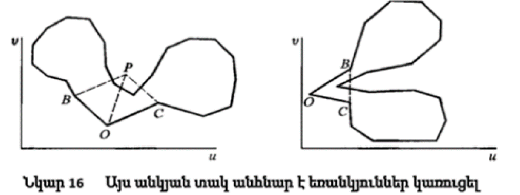{width="3.878934820647419in"
height="1.4603849518810148in"}Նման իրավիճակները ներկայացված են նկ.16։
Դրանք կարող են առաջանալ, երբ կառուցված եռանկյունների կողմերը հատում են
աշխատանքային բազմանկյան այն կողմերը, որոնք հարևան չեն: Նախքան նոր
եռանկյուն կառուցելը, ինչպես նկ.12 , այնպես էլ նկ. 14, պետք է իրականացվի
արդյունարար բազմանկյան ինքնահատման բացակայության ստուգում։ Ընդ որում, P
կետի դիրքը որոշելիս կարևոր է, որ այն գտնվում է աշխատանքային բազմանկյան
մյուս կետերից բավարար հեռավորության վրա և չմոտենա բազմանկյունի կետերը
միացնող հատվածներին։ Հակառակ դեպքում, հետագայում կարող են
դժվարություններ առաջանալ եռանկյուններ կառուցելիս: Հետևաբար, նախքան
աշխատանքային բազմանկյունը նեղացնելը, մենք պետք է ստուգենք արդյունարար
բազմանկյան ինքնահատում ունենալու փաստը: Եթե եռանկյունը (եռանկյունները)
հնարավոր չէ կառուցել O կետի մոտ, ապա դրա փոխարեն մենք պետք է գտնենք մեկ
այլ կետ, որտեղ բազմանկյունն ավելի շատ է փաթաթվում եզրագծից ներս և դրա
ներսում կատարեք նկարագրված գործողությունները: Հաջորդը, փոփոխված
աշխատանքային բազմանկյան համար կկատարենք նույն գործողությունները, որոնք
հենց նոր նկարագրվեցին: Գտնենք աշխատանքային բազմանկյան մի կետ, որտեղ այն
ավելի շատ է փաթաթվում դեպի տիրույթի ներս, քան մյուս կետերում,
իրականացնենք նրանում բազմանկյան նեղացնելու հնարավորության ստուգում՝ մեկ
կամ երկու եռանկյուններ կառուցելով և նեղացնենք բազմանկյունը։

Շարունակելով այս գործընթացը՝ մենք կընդլայնենք երկչափ կետերի և
եռանկյունների զանգվածը, և միևնույն ժամանակ կնեղացնենք աշխատանքային
բազմանկյունը՝ փոքրացնելով նրա ծածկած տարածքը և կետերի քանակը։ Այս
գործողությունների ինչ-որ փուլում մենք կստանանք երեք կետից բաղկացած
աշխատանքային բազմանկյուն: Այս կետերի վրա կառուցենք վերջին եռանկյունը,
վերացնենք աշխատանքային բազմանկյունը և ավարտենք եռանկյունացումը։
Եռանկյունացման նկարագրված մեթոդում աշխատանքային բազմանկյունով
սահմանափակվածտիրույթը, այսպես ասած, վերացվում է՝ դրանից եռանկյուններ
հեռացնելով։ Այժմ դիտարկենք ընդհանուր դեպքը, երբ մակերևույթի պարամետրերի
տիրույթը սահմանափակվում է մեկ արտաքին եզրագծով և մի քանի ներքին
եզրագծերով, որոնք ամբողջությամբ գտնվում են արտաքին եզրագծի ներսում:
Մակերևույթի սահմանը մոտարկենք պարամետրային տիրույթի փակ
բազմանկյուններով։ Յուրաքանչյուր եզրագծի համար մենք կկառուցենք իր սեփական
բազմանկյունը: Ինչպես եզրագծերի, այնպես էլ դրանց վրա կառուցված
բազմանկյունների համար պետք է պահպանվի նրանց փոխադարձ կողմնորոշման
կանոնը։ Ներքին բազմանկյունների կողմնորոշումը պետք է լինի արտաքին
բազմանկյունի կողմնորոշման հակառակ կողմը: Սկսենք կառուցել եռանկյունացումն
արտաքին եզրագծի բազմանկյունով: Դրա կետերը դնենք ստացված երկչափ կետերի
զանգվածի մեջ, իսկ բազմանկյունը դարձնենք աշխատանքային: Եռանկյունները
կառուցում ենք այնպես, ինչպես միակապ տիրույթի դեպքը։ Գործող
բազմանկյունում գտնենք O կետը, ստուգենք նրանում բազմանկյունը նեղացնելու
հնարավորությունը և նեղացնենք բազմանկյունը։ Եթե կան ներքին եզրագծեր, ապա
ավելի դժվար է դառնում ստուգել ընտրված կետում աշխատանքային բազմանկյունը
նեղացնելու հնարավորությունը։ Բացի աշխատանքային բազմանկյան հետ եռանկյան
կողերի հատման նկարագրված ստուգումներից, պետք է ստուգել նաև եռանկյան
կողերի րբոլոր ներքին բազմանկյունների հետ հատումների փաստերը։ Դիցուք
ստուգ ենք O կետում երկու եռանկյունների կառուցելու հնարավորությունը (նկ.
2․20), և պարզվեց, որ կառուցվող նոր P կետը ընկնում է ներքին
բազմանկյուններից մեկի ներսում կամ անընդունելի մոտ կլինի նրա հատվածներին:
Այս դեպքում մենք ոչ թե P կետը կկառուցենք, այլ փոխարենը մենք այս ներքին
բազմանկյունը կներառենք աշխատանքային բազմանկյունի մեջ՝ կառուցելով երկու
եռանկյունացում, ինչպես ցույց է տրված Նկ. 17-ում։ Ներքին բազմանկյուններից
մեկի կետերը աշխատանքային բազմանկյունում ներառելու համար ներքին
բազմանկյան կետերից գտնում ենք աշխատանքային բազմանկյան C կետին (O կետին
կից) ամենամոտ կետը։ Այժմ կառուցենք եռանկյուններ OCF և CEF կետերի վրա և
աշխատանքային բազմանկյան O և C կետերի միջև տեղադրենք ներքին բազմանկյան
կետերը, սկսած F կետից և վերջացրած E կետով: Այսպիսով, մենք OC հատվածում
կխզենք աշխատանքային բազմանկյունը, կխզենք ներքին բազմանկյունը EF
հատվածում և դրանք կնիավորենք OF և EC հատվածներով:

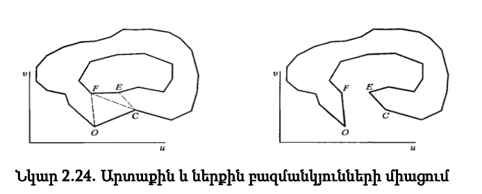{width="5.098194444444444in"
height="1.6886307961504812in"}

> ***Նկ 17 Նկ 18***
>
> ***Նկ17. Երկու եռանկյունների կառուցում***
>
> ***Նկ18. Արտաքին և ներքին նազմանկյունների միաձուլումը***

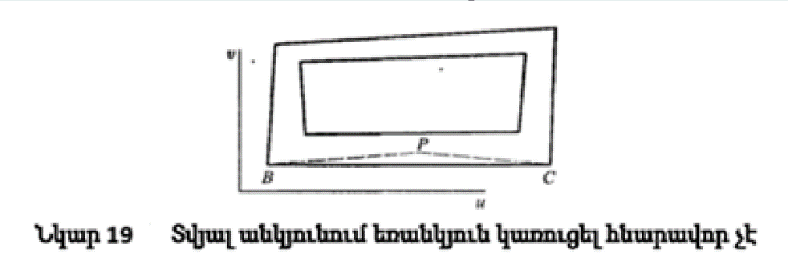{width="3.584096675415573in"
height="1.1304866579177604in"}Միացման արդյունքը ներկայացված է նկ18․-ում։
Իհարկե, արտաքին և ներքին բազմանկյունների միացումից առաջ պետք է ստուգել
այս գործողության կոռեկտության հարցը։ Այնուհետև մենք կշարունակենք
նեղացնել աշխատանքային բազմանկյունը նկարագրված ձևով, մինչև հայտնվենք մեկ
այլ ներքին բազմանկյան մոտ և մինչև չներառենք այն աշխատանքային բազմանկյան
մեջ: Արդյունքում բոլոր ներքին բազմանկյունները կներառվեն աշխատանքային
բազմանկյան մեջ, որը պետք է նեղացվի մինչև վերջին երեք կետերը:
Արդյունքում, մակերևույթի պարամետրերի ամբողջ բազմակապ տիրույթը ծածկվելու
է եռանկյուններով:

Լինում են իրավիճակներ, երբ տվյալ բազմանկյունների վրա անհնար է կառուցել
մեկ եռանկյուն։ Նկ.19․-ում ցույց է տրված նաև երկու բազմանկյուններով
սահմանափակված տիրույթ, որոնցից յուրաքանչյուրը բաղկացած է չորս հատվածից։
Արտաքին բազմանկյան համար մենք չենք կարող շարունակել եռանկյունացումը,
քանի որ ներքին բազմանկյունը խանգարում է: Այս դեպքում մենք գտնում ենք
բազմանկյան երկու հարևան B և C կետեր, որոնց համար կարող ենք կառուցել BCP
եռանկյուն: P կետը պրոեկտվում է BC կողմի միջնակետին և գտնվում է նրանից
այնպիսի հեռավորության վրա, որ նոր եռանկյունը չի հատում բազմանկյունները։
Հաջորդիվ շարունակվում է եռանկյունացումը վերը նկարագրված ձևով:

*Մեկ այլ եռանկյունացման տարբերակ*։ Գոյություն ունեն եռանկյունացման այլ
տարբերակներ: Օրինակ, մակերևույթի որոշման տիրույթի արտաքին և ներքին
եզրագծերի բազմանկյունները կառուցելուց հետո կարելի է ընտրել եռանկյունների
կառուցման այլ տարբերակ։ Մեկ այլ տարբերակում կարելի է միաձուլել արտաքին և
ներքին բազմանկյունները մեկ բազմանկյան մեջ՝ նախքան եռանկյունացումը
սկսելը: Կարելի է պարամետրերի որոշման տիրույթի ներսում,որոշակի ալգորիթմի
համաձայն «ուրվագծել» կետերը և կատարել Դելոնեի եռանկյունացում՝
օգտագործելով դրանք և սահմանային եզրագծերի բազմանկյան կետերը: Կան
ալգորիթմներ, որոնք նախ կառուցում են մեծ եռանկյուններ, իսկ հետո դրանք
բաժանում ընդունելի չափերի։

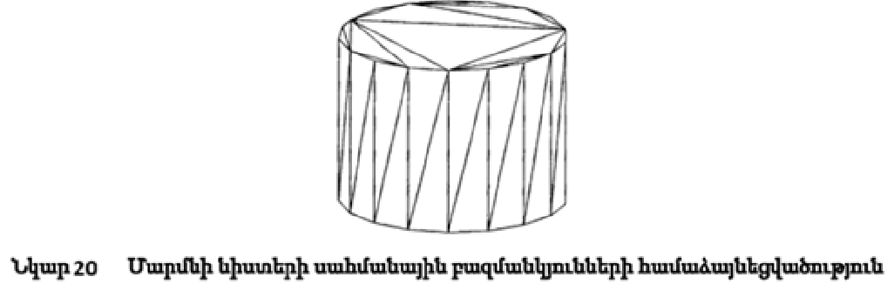{width="4.648924978127734in"
height="1.544818460192476in"}*Մարմնի եռանկյունացում։* Մարմնի
եռանկյունացումը դա եռանկյունների ամբողջություն է, որը ստացվում է նրա
նիստերի մակերևույթները եռանկյունացնելով։ Առանձին մակերևույթների
եռանկյունացումը տարբերվում է մարմնի նիստերի եռանկյունացումից նրանով, որ
վերջին դեպքում հարակից նիստերի սահմանային բազմանկյունները պետք է
համաձայնեցվեն(նկ.20): Հարևան նիստերիի բազմանկյունների մասերը, որոնք
անցնում են ընդհանուր կողերով, կհամաձայնեցվեն, եթե դրանց կետերը համընկնեն
տարածության մեջ:

*Եռանկյունացման կիրառում.* Եռանկյունացման արդյունքում կառուցված
եռանկյունները օգտագործվում են տոնային պատկերներ ստանալու համար։ Նկ.21․ և
22-ում ներկայացված են թիթեղային մարմնի նիստերի եռանկյունացումներ։

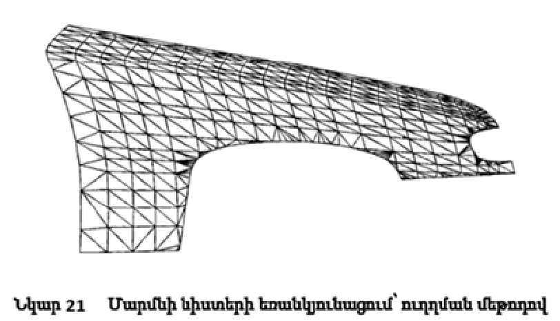{width="3.473924978127734in" height="1.99375in"}

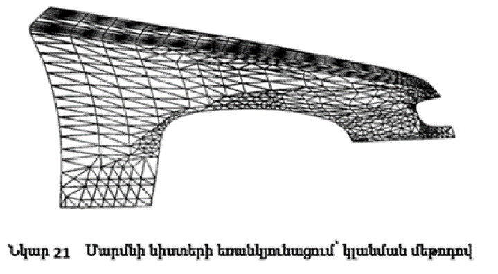{width="3.26875in"
height="1.7972222222222223in"}Մակերևույթի պարամետրերի սահմանման տիրույթի
եռանկյունների բաժանելը կարող է օգտագործվել մի շարք ինտեգրալներում, որոնք
օգտագործվում են մարմինների երկրաչափական բնութագրերը հաշվարկելիս \[1\]։

**Գլուխ 2**

**Եռանկյունացման ալգորիթմների մի շարք կիրառությունների մասին**

**2.1 Անբացահայտ տրված մակերևույթների եռանկյունացման մակերևույթների
ալգորիթմներ**

Որպես անբացահայտ ձևով տրված մակերևույթի պատկերում ասելով հասկանում ենք
այն մակերեսի պատկերումը, որը տրված է երեք արգումենտներից կախված
ֆունկցիայի և այդ ֆունկցիայի ֆիքսված արժեքի (մակարդակի) միջոցով.

(x, y, z) \| f(x, y, z) = c) (1.1)

որտեղ f(x,y,z)--- տրված ֆունկցիան է, իսկ c --- տրված մակարդակը։\
Մակերևույթի պատկերման (surface rendering) ալգորիթմները կառուցում են
մակերևույթի պատկեր՝ եռաչափ տարածության մեջ։ Սակայն, ավելի հարմար է
վերականգնել ոչ թե մակերևույթն ինքնին, այլ ցանկալիին մոտեցնող
մակերևույթը՝ օգտագործելով եռանկյունիներ: Այսպիսով, սկզբում սկզբնական
մակերեսը մոտարկվում է բազմանկյուններով (պոլիգոններով), ապա իրականացվում
է բազմանկյունների պատկերում գրաֆիկական գրադարանների միջոցով: Տարբեր
ձևերով սահմանված մակերևույթի պատկերման խնդիրը առաջանում է մաթեմատիկայի,
ֆիզիկայի և բժշկության բազմաթիվ ոլորտներում:

--- *Փորձարարական տվյալների պատկերում:* Ֆիզիկական փորձեր անցկացնելիս
հաճախ անհրաժեշտ է միաժամանակ ցուցադրել բոլոր տվիչներից ստացված
ինֆորմացիան: Օրինակ, միջավայրի ջերմաստիճանի չափման ժամանակ անհրաժեշտ է
պատկերել այն տարածքը, որտեղ ջերմաստիճանը բարձր է որոշված սահմանաչափից։

--- *Ֆունկցիոնալ ներկայացում։* Որոշ մաթեմատիկական խնդիրներում կամ
հաշվարկներում անհրաժեշտ է պատկերել երկրաչափական օբյեկտ, որը տրված է մի
քանի փոփոխականներից կախված իրական անընդհատ նկարագրող ֆունկցիայի միջոցով՝
F(X)\>0տեսքով։ Նաեւ կարող է առաջանալ ընդհանուր խնդիր, երբ նկարագրող
ֆունկցիան տրված է այն կետերի բազմությամբ, որտեղ դրա արժեքը հայտնի է։

---*Բժշկություն։* Համակարգիչների օգտագործումը հնարավորություն տվեց
զարգացնել տոմոգրաֆիկ պատկերման նոր ուղղություններ, ինչպիսիք են
համակարգչային տոմոգրաֆիան, մագնիսա-ռեզոնանսային տոմոգրաֆիան և
պոզիտրոն-էմիսիոն տոմոգրաֆիան։ Տոմոգրաֆիկ սարքավորումների միջոցով
հնարավոր է ստանալ հիվանդի մարմնի բազմաթիվ հատվածների նկարներ, որոնք
բնութագրում են նրա անատոմիական և ֆիզիոլոգիական առանձնահատկությունները։
Այս պատկերները շատ պարզ ցույց են տալիս տարբեր օրգանները ընդ որում
օրգանների պատկերները միմյանց վրա չեն դրվում և ներկայացվում են առանձին։
Պատկերման մեթոդները հնարավորություն են տալիս վերակառուցել օրգանների
եռաչափ կառուցվածքը՝ օգտագործելով բազմաթիվ զուգահեռ հատույթներ։ Շատ
դեպքերում՝ ախտորոշման համար, բժիշկը տեսողականորեն վերլուծում է առանձին
հատվածների պատկերները, որոնք ստացվում են տոմոգրաֆիկ հետազոտության
ժամանակ։ Սակայն որոշ կլինիկական խնդիրների դեպքում, օրինակ՝ վիրաբուժական
պլանավորման համար, անհրաժեշտ է հասկանալ եռաչափ կառուցվածքի ամբողջ
բարդությունը և տեսնել առկա դեֆեկտները։ Փորձը ցույց է տվել, որ օբյեկտների
«մտավոր վերականգնումը» շերտային պատկերների հիման վրա չափազանց դժվար է և
կախված է դիտորդի փորձից ու երևակայությունից։ Նման իրավիճակներում ցանկալի
է ներկայացնել մարդու մարմինը այնպես, ինչպես այն կտեսներ վիրաբույժը կամ
անատոմը։\
Նմանատիպ մոտեցումներ կիրառվում են նաև փորձարարական և մոդելային տվյալների
համար, ինչպիսիք են հեղուկների դինամիկան, երկրաբանությունը,
օդերևութաբանությունը և մոլեկուլային վերլուծությունը: Պատկերման խնդիր
լուծելիս կարևոր դեր է խաղում, որոնվող մակերևույթը նկարագրող ֆունկցիան
սահմանելու մեթոդը։ Բազմաթիվ կիրառական խնդիրներում ֆունկցիան տրվում է
կանոնավոր ցանցի վրա՝ աղյուսակային ձևով, կամ ունի բացահայտ արտապատկերում,
տրված բանաձևով (2.1)։ Սակայն երբեմն առաջանում են խնդիրներ, որոնցում չկա
հստակ արտապատկերում, կամ արժեքների աղյուսակը տրված է անկանոն ցանցի վրա։
Նման խնդիրներ կարող են առաջանալ բազմաթիվ կիրառություններում, օրինակ՝
ճառագայթման միջոցով մակերևույթից հեռավորությունը չափելիս կամ բժշկական
հետազոտություններում բազմակի կոնտուրային «կտորների» միջոցով եռաչափ
կառուցվածքը վերակառուցելիս:

Նման խնդիրներում կիրառվում է հետևյալ մոտեցումը  S մակերևույթը, որը տրված
է X կետերի բազմությամբ, մոտարկվում է շոշափող հարթություններով, որոնք
անցնում են X բազմության յուրաքանչյուր կետով: Այնուհետև որոնվող
մակերևույթը սահմանող ֆունկցիան որոշվում է հետևյալ կերպ․ տարածության
յուրաքանչյուր կետի համար ֆունկցիայի արժեքը այդ կետում հավասար է մինչև
մոտակա շոշափող հարթությունը հեռավորությանը, վերցված «+» նշանով, եթե կետը
գտնվում է կառուցված հարթություններով սահմանափակված ծավալի ներսում, կամ
«−» նշանով, եթե կետը գտնվում է այդ ծավալից դուրս: Հաջորդիվ, իրականացվում
է ստացված ֆունկցիայի միջոցով սահմանված մակերեսի պատկերում։ Հասկանալի է,
որ սկզբնական կետերի բազմության հիման վրա եռանկյունացում  կառուցելու
խնդիրը այնքան էլ ճշգրիտ չէ, ուստի հարց է առաջանում, թե հնարավոր
եռանյունացման ալգորիթմներից որն է ավելի լավ։ Եռանկյունացումը կոչվում է
օպտիմալ, եթե նրա բոլոր կողերի երկարությունների գումարը նվազագույն է
տվյալ կետերի բազմության բոլոր հնարավոր եռանկյունացումների համար։

Ալգորիթմի սկիզբը.

Քայլ 1. Սկզբում կազմվում է բոլոր հնարավոր հատվածների ցուցակը, որոնք
միացնում են տրված կետերի զույգերը։ Այնուհետև այդ ցուցակը դասավորվում է
ըստ հատվածների երկարության։

Քայլ 2. Սկսած ամենակարճից, հաջորդաբար կատարվում է հատվածների ներդրում
եռանկյունացման մեջ։ Եթե հատվածը չի հատում այլ, նախկինում ավելացված
հատվածներին, ապա այն ավելացվում է, հակառակ դեպքում՝ դեն է նետվում։

Ալգորիթմի ավարտ։

Հարկ է նշել, որ եթե բոլոր հնարավոր հատվածներն ունեն տարբեր
երկարություններ, ապա այս ալգորիթմի արդյունքը միանշանակ է: Իսկ եթե կան
հավասար երկարությամբ հատվածներ, արդյունքը կախված է նույն երկարություն
ունեցող հատվածների ավելացման հերթականությունից։

Այս ալգորիթմը ագահ է (greedy), հետևաբար դրա կառուցած եռանկյունացումը
նույնպես կոչվում է "ագահ" եռանկյունացում։ Այդ ալգորիթմի հաշվարկային
բարդությունը որոշ բարելավումներով կազմում է մոտավորապես O(N² log N)**։**
Աշխատանքի նման բարձր բարդության պատճառով այս ալգորիթմը գործնականում
գրեթե չի օգտագործվում։

**Եռանկյունացման խնդիրը լուծելու մեթոդներ**

Օպտիմալ և "ագահ" եռանկյունացումներից բացի, գոյություն ունեն նաև
եռանկյունացման այլ տեսակներ և դրանք կառուցելու ալգորիթմներ։
Եռանկյունացման խնդիրը լուծելու բոլոր մեթոդները կարելի է բաժանել հետևյալ
երեք խմբերի \[3\].

--- *Բջջային մեթոդներ (cell-based)**.*** Այս տիպի մեթոդներում
եռանկյունացման տարածքը բաժանվում է բջիջների\` զուգահեռանիստների
եռանկյունաձև բուրգերի, տետրաեդրոնների, օկտաեդրոնների և այլն: Այնուհետև
յուրաքանչյուր բջիջի ներսում առանձին իրականացվում է եռանկյունացում։ Ընդ
որում, յուրաքանչյուր բջիջ եռանկյունացվում է նախապես սահմանված
եղանակներից մեկով, այսինքն՝ եռանկյունների համար կոորդինատների արժեքները
պարզապես «փոխարինվում են» նախապես սահմանված աղյուսակից: Այս մեթոդները
կիրառելու համար նախապես սահմանվում է թույլատրելի մոտարկման սխալը, որի
հիման վրա ընտրվում է բջիջի չափը: Դրանից հետո, արդեն հայտնի
եռանկյունացման աղյուսակների միջոցով, ստացվում է փնտրվող եռանկյունների
բազմությունը: Այս դեպքում, յուրաքանչյուր բջիջի եռանկյունացման
ընթացակարգը հանգեցվում է բջջի գագաթներում ֆունկցիայի արժեքների
վերլուծությանը՝ այլ կերպ ասած, որոշվում է, թե որ գագաթներն են գտնվում
մակերևույթի «ներսում», և որոնք՝ «դրսում»: Դրա հիման վրա կարելի է
եզրակացնել, որ բավարար է ֆունկցիան որոշել միայն բջիջների գագաթներում:
Ամենահայտնի բջջային ալգորիթմներն են՝ Կանեյրոյի մեթոդը (Caneiro),
Գուեզեկի առաջարկած մեթոդը, Սկալայի մեթոդը (Skala) և «Քայլող խորանարդներ»
մեթոդը (Marching Cubes):

--- *Կանխատեսող-ուղղիչ մեթոդը(predictor-corrector).* Այս դասի մեթոդները
հիմնված են այն գաղափարի վրա, որ արդեն գոյություն ունեցող եռանկյունացման
կետերի բազմությանը ավելացվում է նոր կետ։Սկզբում այդ կետը դրվում է տվյալ
ֆունկցիային շոշափող հարթության վրա (սա պրեդիկտորի (predictor) դիրքն է
(predictor)։ Այնուհետև այդ կետը տեղափոխվում է դեպի իրական մակերևույթ՝
ստանալով ուղղված կետ (corrector)**։** Այս մեթոդները կիրառելու համար
անհրաժեշտ է իմանալ ֆունկցիայի արժեքները տարածության բոլոր կետերում և
գտնել առնվազն մեկ կետ, որը պատկանում է փնտրվող մակերևույթին: Մեթոդը
կայանում է եռանկյունների քանակի իտերատիվ ավելացման մեջ. մեթոդի
յուրաքանչյուր իտերացիայի ժամանակ արդեն գոյություն ունեցող եռանկյունների
բազմությանը ավելացվում է ևս մեկ եռանկյուն, որը կառուցվում է\` գոյություն
ունեցող եզրային եռանկյան կողի վրա և այն կետի վրա, որն սկզբում
«նախատեսված» է (predictor), ապա ուղղված է (corrector)՝ ելնելով
մակերևույթի կորությունից։

***--- **Որմնանկարչական/Մոզայիկային մեթոդներ (pre-tessellation methods &
particle-based methods):* Այսպիսի մեթոդների էությունը կայանում է փնտրվող
մակերևույթի մասերի բաժանելու մեջ՝ դրանց հետագա եռանկյունացման համար:
Pre-tessellation մեթոդներում բաժանումը ենթադրում է մակերևույթի տրոհում
«պրիմիտիվ» մակերևույթների՝ գնդային հատվածների և հարթությունների։
Particle-based մեթոդներում բաժանումը ավելի քիչ «ինտելեկտուալ» է․ այստեղ
գտնում են միայն հարթության հատվածներ։ Այս դեպքում առաջանում է արդեն
«եռանկյունացված» մասերը «միացնելու» խնդիր: Ամենից հաճախ այս գործընթացը
հանգեցվում է Դելոնեի եռանկյունացմանը, այսինքն՝ փնտրվող մակերեսի մասերը
միացնող, Դելոնեի տեղական եռանկյունների ընտրությանը:

Բոլոր այս մեթոդներն ունեն ինչպես իրենց առավելությունները, այնպես էլ
թերությունները: Առաջին տեսակի մեթոդների հիմքում ընկած է յուրաքանչյուր
բջջի անկախ եռանկյունացումը՝ օգտագործելով եռանկյունացման աղյուսակներ,
ինչը միաժամանակ նրանց թե՛ ուժեղ, թե՛ թույլ կողմն է։ Այդ մեթոդների
աշխատանքի բարձր արագությունը դրանք դարձնում է ամենագրավիչը այլ մեթոդների
նկատմամբ և հնարավորություն է տալիս օգտագործել դրանք ինտերակտիվ
հավելվածներում: Սակայն դրանց էական թերությունը համարվում է այն, որ դրանք
քիչ զգայուն են ընտրած կետերի բազմությունից դուրս ֆունկցիայի իրական
վարքագծի նկատմամբ։ Այլ կերպ ասած՝ այս մեթոդները չեն կարող ճիշտ արտացոլել
տեղային կորություններ, քանի որ եռանկյունիների չափը միշտ համեմատական է
բջջի չափին։ Այս մեթոդները հատկապես արդյունավետ են եռաչափ սկալյար դաշտերի
պատկերման համար, երբ դաշտը տրված է կանոնավոր ցանցի վրա։ Մյուս՝ երկրորդ և
երրորդ խմբի մեթոդները կիրառելի են միայն այն դեպքում, երբ ֆունկցիայի
արժեքները հայտնի են տարածության բոլոր այն կետերում, որոնք մեզ
հետաքրքրում են։ Նրանց առավելությունը տեղային կորության նկատմամբ
զգայունությունն է․ այս մոտեցմամբ մանր դետալները չեն «կորչում»։ Չնայած
առաջին խմբի մեթոդների համեմատ արագության էական նվազմանը, ինչպես նաև
ֆունկցիայի դիֆերենցելիություն\
ունենալու և մակերևույթի կապակցված լինելու պահանջներին, այս մեթոդները
գրավում 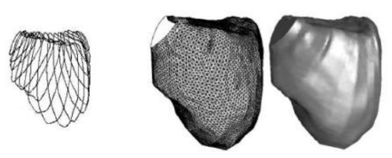{width="4.415277777777778in"
height="1.7784722222222222in"}են ստացվող մակերևույթի բարձր «որակով»։

Նկ.23. Մարդու միզապարկի պատկերումը: Ձախ կողմում՝ ուլտրաձայնային
հետազոտության միջոցով ստացված տվյալներ, աջ կողմում՝ վերակառուցված
մակերևույթը:

**Դելոնեի եռանկյունացման կառուցման ալգորիթմների մասին**

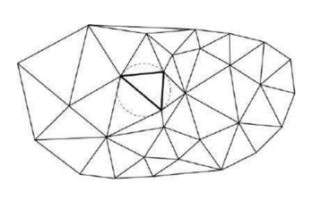{width="1.8076388888888888in"
height="1.2041666666666666in"}Գոյություն ունեն ալգորիթմներ, որոնք
հասնում են Դելոնեյի եռանկյունացման կառուցման հաշվարկային բարդությանը
միջին և վատագույն դեպքերում։ Բացի այդ, հայտնի են ալգորիթմներ, որոնք մի
շարք դեպքերում հնարավորություն են տալիս միջին հաշվով հասնել O(N)
բարդության: ***նկ24** **Դելոնեի եռանկյունացում***

Դիտարկենք Դելոնեի եռանկյունացում կառուցելու ամենահայտնի ալգորիթմների
ցանկը՝ դրանց արդյունավետության գնահատականով։

1.  Իտերատիվ ալգորիթմներ.\
    (ա) Պարզ իտերատիվ ալգորիթմ;\
    (բ) Եռանկյունների որոնումը ինդեքսավորմամբ ալգորիթմներ;\
    (գ) Եռանկյունների որոնումը քեշավորմամբ ալգորիթմներ;\
    (դ) Կետերի ավելացման փոփոխված հերթականությամբ ալգորիթմներ:

Իտերատիվ ալգորիթմներից ամենաարդյունավետը եռանկյունիների որոնման դինամիկ
քեշավորմամբ ալգորիթմն է, որի բարդությունը միջինում կազմում է O(N)։

2\. Միաձուլման միջոցով Դելոնեի եռանկյունացում կառուցելու ալգորիթմներ.

> (ա) «Բաժանիր և տիրիր» միաձուլման ալգորիթմ;\
> (բ) Տրամագծով կտրելու ռեկուրսիվ ալգորիթմ;\
> (գ) Շերտային միաձուլման ալգորիթմներ:

Միավորման ալգորիթմներից ամենաարդյունավետը ոչ ուռուցիկ Շերտային միավորման
ալգորիթմն է, որի բարդությունը միջինում կազմում է O(N)։

3\. Դելոնեի եռանկյունացման ուղղակի կառուցման ալգորիթմներ

(ա) Քայլ առ քայլ ալգորիթմ;

(բ) Քայլ առ քայլ ալգորիթմներ՝ Դելոնեի հարևանների որոնման արագացմամբ:

Ուղղակի կառուցման ալգորիթմներից ամենաարդյունավետը քայլ առ քայլ բջջային
ալգորիթմն է, որի բարդությունը միջինում կազմում է O(N)։

4\. Դելոնեի եռանկյունացում կառուցելու երկփուլ ալգորիթմներ

> (ա) Երկափուլային միավորման ալգորիթմներ;\
> (բ) Մոդիֆիկացված հիերարխիկ ալգորիթմ;\
> (գ) Գծային ալգորիթմ;
>
> (դ) Հովանաձև ալգորիթմ;\
> (ե) Ռեկուրսիվ տրոհման ալգորիթմ;\
> (զ) Ժապավենային ալգորիթմ:

Երկափուլային ալգորիթմներից ամենաարդյունավետը ոչ ուռուցիկ գոտային
միավորման երկափուլային ալգորիթմն է, որի բարդությունը միջինում կազմում է
O(N)։ Այսօր շատերը շարունակում են աշխատել հայտնի ալգորիթմների
կատարելագործման և նոր ալգորիթմների ստեղծման վրա։Դա պայմանավորված է մի
շարք հայտնի ալգորիթմների անկայունությամբ և դրանց անբավարար արագությամբ
աշխատանքի՝ իրական տվյալների հավաքածուների վրա։ Ստորև ներկայացված են որոշ
ալգորիթմներ, որոնք, համարվում են Դելոնեի եռանկյունացման ամենաարագ և
միաժամանակ ամենապարզը իրականացման համար։

**Իտերատիվ ալգորիթմներ**

Բոլոր իտերատիվ ալգորիթմները հիմնված են մասնակիորեն կառուցված Դելոնեի
եռանկյունացմանը հաջորդաբար կետեր ավելացնելու գաղափարի վրա։ Ֆորմալ սա
կարելի է նկարագրել այսպես․ Ունենք Դելոնեի եռանկյունացում (n-1) կետերի
բազմության վրա։ Հաջորդ n-րդ կետը ավելացվում է արդեն կառուցված
եռանկյունացման կառուցվածքում հետևյալ կերպ․

Քայլ 1 Կետի տեղայնացում: Սկզբում կատարվում է կետի լոկալիզացիա, այսինքն՝
գտնվում է այն եռանկյունը (նախկինում կառուցված), որի ներսում է ընկնում
հերթական կետը: Եթե կետը չի ընկնում եռանկյունացման ներսում, գտնում են այն
եռանկյունը եռանկյունացման սահմանի վրա, որը մոտ է հաջորդ կետին։

Քայլ 2. Կետի տեղադրումը եռանկյունացման մեջ: Եթե կետը ընկնում է արդեն
գոյություն ունեցող հանգույցի վրա, այն սովորաբար մերժվում է։ Հակառակ
դեպքում, կետը ավելացվում է որպես նոր հանգույց։ Եթե կետը ընկել է որևէ
կողի վրա, ապա այն բաժանվում է երկու նոր կողերի, և կողին կից երկու
եռանկյունները նույնպես բաժանվում են երկու ավելի փոքրերի: Եթե կետը
ընկնում է որևէ եռանկյան ներսում, այդ եռանկյունը բաժանվում է երեք նոր
եռանկյան։ Եթե կետը ընկել է եռանկյունացմանից դուրս, ապա կառուցվում է մեկ
կամ ավելի եռանկյուններ: Այնուհետև նոր ստացված եռանկյունների համար
կատարվում են տեղային ստուգումներ՝ Դելոնեի պայմանին համապատասխանելու
համար, և կատարվում են անհրաժեշտ կառուցումները։Այս ալգորիթմի բարդությունը
կախված է մի քանի գործոնից՝ Եռանկյան որոնման աշխատանքի բարդությունը, որի
մեջ հաջորդ քայլում կետը պետք է ավելացվի, նոր եռանկյունների կառուցման
բարդությունը, ենթադրված Դելոնեի պայմաններին չհամապատասխանող հարևան
եռանկյունների զույգերի ստուգումների և եռանկյունացման կառուցվածքի
համապատասխան փոփոխությունների բարդությունը։ Նոր եռանկյուններ կառուցելիս
հնարավոր է երկու իրավիճակ. ավելացվող կետը ընկնում է կամ եռանկյունացման
ներսում, կամ դրսում: Կետը ընկնում է եռանկյունացման ներսում՝ այս դեպքում
կառուցվում են նոր եռանկյուններ, և ալգորիթմի գործողությունների քանակը
հաստատուն է։ Կետը գտնվում է եռանկյունացման սահմաններից դուրս՝ այս
դեպքում անհրաժեշտ է ստեղծել լրացուցիչ, ընթացիկ եռանկյունացման
սահմաններից դուրս գտնվող եռանկյուններ, որոնց քանակը վատագույն դեպքում
կարող է հասնել n−3-ի։ Այնուամենայնիվ, ալգորիթմի ամբողջ աշխատանքում ոչ
ավելի, քան 3N եռանկյուն է ավելացվելու, որտեղ N՝ սկզբնական կետերի
ընդհանուր քանակը։ Ուստի, երկու իրավիճակներում էլ ընդհանուր ժամանակը, որն
անհրաժեշտ է եռանկյուններ կառուցելու համար, կազմում է O(N):
Եռանկյունացման մեջ ցանկացած նոր կետի ավելացում տեսականորեն կարող է
խախտել Դելոնեի պայմանը, այդ պատճառով կետի ավելացումից հետո սովորաբար
անմիջապես իրականացվում է տեղային ստուգում՝ ստուգելու համար, թե արդյոք
եռանկյունացումը շարունակում է բավարարել Դելոնեի պայմանը։ Այս ստուգումը
պետք է ընդգրկի բոլոր նոր ստեղծված եռանկյունները և նրանց հարևանները։
Վատագույն դեպքում նման փոփոխությունների քանակը կարող է հանգեցնել ամբողջ
եռանկյունացման կրկնակի կառուցմանը, այդ պատճառով վերակառուցման
բարդությունը կազմում է O(N): Սակայն իրական տվյալների վրա միջինում նման
փոփոխությունների քանակը ընդամենը մոտ երեքն է։ Այսպիսով, իտերատիվ
ալգորիթմի բարդության մեջ ամենամեծ ներդրումը տալիս է հաջորդ եռանկյան
որոնման ընթացակարգը։ Հենց այդ պատճառով է, որ Դելոնեի եռանկյունացում
կառուցելու բոլոր իտերատիվ ալգորիթմները միմյանցից հիմնականում տարբերվում
են միայն հերթական եռանկյունը գտնելու ընթացակարգով:

**Պարզ իտերատիվ ալգորիթմ**

Պարզ իտերատիվ ալգորիթմում հաջորդ եռանկյան որոնումը իրականացվում է
հետևյալ կերպ. Վերցվում է ցանկացած եռանկյուն, որն արդեն պատկանում է
եռանկյունացմանը (օրինակ՝ ընտրենք պատահականորեն), և կապակցված
եռանկյուններով հաջորդական անցումներ կատարելով՝ որոնվում է անրաժեշտ
եռանկյունը: Վատագույն դեպքում անհրաժեշտ է անցնել եռանկյունացման բոլոր
եռանկյունների միջով, այդ պատճառով այդ որոնման բարդությունը կազմում է
O(N): Սակայն միջինում, երբ կետերը հավասարաչափ բաշխված են ուղղանկյան մեջ,
անհրաժեշտ է կատարել միայն O(√N) անցումներ։ Այսպիսով, պարզ իտերատիվ
ալգորիթմի բարդությունը կազմում է՝ վատագույն դեպքում կազմում է O(N²)**,**
իսկ միջին հաշվով՝ O(N^3/2^): Շատ դեպքերում սկզբնական կետերը վիճակագրորեն
անկախ չեն, և n-րդ կետը գտնվում է (n+1) րդի մոտակայքում։ Այդ պատճառով
որոնման սկզբնական եռանկյունը կարելի է ընտրել որպես այն եռանկյունը, որը
արդեն գտնվել է նախորդ կետի համար։ Այդ կերպ որոշ դեպքերում հնարավոր է
միջին բարդություն հասնել O(N)՝ որոշ տեսակի սկզբնական տվյալների համար։

**Եռանկյունների որոնման քեշավորված ալգորիթմներ**

Այս ալգորիթմների իրականացման ժամանակ ստեղծվում է քեշ՝ հատուկ կառուցվածք,
որը թույլ է տալիս O(1) ժամանակում գտնել մի եռանկյուն, որը մոտ է
անհրաժեշտին։Այնուհանդերձ, փոփոխված եռանկյունները քեշից չեն հեռացվում
(ընդունվում է, որ յուրաքանչյուր հեռացված եռանկյուն որպես հիշողության մեջ
գրառում վերածվում է նոր եռանկյան, ուստի ալգորիթմի ընթացքում
եռանկյունների հասցեների ճշգրտությունը պահպանվում է)։ Մեկ եռանկյուն կարող
է բազմակի անգամ հայտնվել քեշում իսկ որոշ եռանկյուններ կարող են
ընդհանրապես բացակայել դրանից:

Քեշավորման հիմնական գաղափարը կայանում է հարթությունը ավելի պարզ
բաժանելու մեջ, քան եռանկյունացումը, որում կարելի է արագ կատարել կետերի
լոկալիզացիա: Պարզ բաժանման յուրաքանչյուր տարրի համար ստեղծվում է հղում
դեպի եռանկյունացման որոշակի եռանկյուն: Որոնման գործընթացը իրականացվում է
հետևյալ կերպ՝ նախ տեղայնացնում են պարզ բաժանման տարրը, ապա անցնում
հղումով դեպի համապատասխան եռանկյուն, և վերջապես այդ եռանկյունը
տեղայնացնում են՝ օգտագործելով Դելոնեի եռանկյունացման պարզ իտերատիվ
ալգորիթմը։Այսպիսի բաժանման համար ամենապարզ տարբերակը կանոնավոր
քառակուսային ցանցի օգտագործումն է (նկ.25)։  Օրինակ, եթե տրված հարթության
բաժանումն ամբողջությամբ տրվում է \[0; 1\]x\[0; 1\] քառակուսով, ապա այն
կարելի է 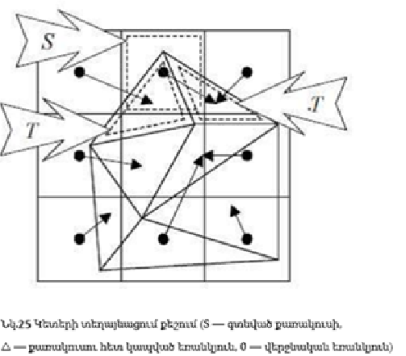{width="2.7764905949256344in"
height="2.4342596237970255in"}բաժանել m² հավասար քառակուսիների: Դրանց
համար բնական կերպով սահմանվում են ցուցիչներ i,j=0..(m−1): Այդ դեպքում,
տրված (x, y) կետի համար մենք կարող ենք գտնել \[x/m\], \[y/m\]
քառակուսին, որտեղ \[\...\]-ն թվի ամբողջ մասն է: Քեշը, որը կառուցված է
կանոնավոր քառակուսային ցանցի տեսքով, լավագույնս գործում է այն դեպքում,
երբ ելակետային կետերը բաշխված են համաչափ, ինչպես նաև այն բաշխումների
դեպքում, որտեղ խտության ֆունկցիան չունի բարձր գագաթներ։Իսկ եթե նախապես
հայտնի է բաշխման բնույթը, ապա կարելի է ընտրել հարթության ինչ-որ այլ
բաժանում (օրինակ՝ անհավասար հեռավորություններով ուղղահայաց և հորիզոնական
ուղիղների տեսքով):

**Որոնման իտերատիվ ալգորիթմ\`** **ստատիկ քեշավորմամբ**

Որոնման ստատիկ քեշավորմամբ եռանկյունացման ալգորիթմում անհրաժեշտ է ընտրել
m թիվը և ստեղծել r երկչափ զանգվածի տեսքով քեշ՝ m × m չափի, եռանկյունների
հղումներ պահելու համար : Սկզբնական փուլում ամբողջ զանգվածը լցվում է
հղումներով դեպի առաջին կառուցված եռանկյունը։ Այնուհետև, հերթական որոնում
կատարելուց հետո, երբ գտնվում է որոշակի եռանկյունը՝ սկսած (i, j)
քառակուսուց, անհրաժեշտ է թարմացնել տեղեկատվությունը քեշում. r\[i\]\[j\]
:=  հղում դեպի T: Ստատիկ քեշի չափը որոշվում է հետևյալ բանաձևով․ m = s ×
N^(3/8)^ բանաձևով, որտեղ s-ը ստատիկ քեշի գործակիցն է: Գործնականում s-ի
արժեքը պետք է վերցնել մոտավորապես 0.6 - 0.9: Սկզբնական փուլում, երբ քեշը
դեռ ամբողջությամբ թարմացված չէ, որոնման գործընթացը կարող է լինել
համեմատաբար դանդաղ։ Սակայն հետագայում, քեշի լրացման հետ մեկտեղ, որոնման
արագությունը զգալիորեն բարձրանում է։ Այս թերությունը զերծ է հաջորդ՝
դինամիկ քեշավորման ալգորիթմը։

**Որոնման իտերատիվ ալգորիթմ՝** **դինամիկ քեշավորմամբ**

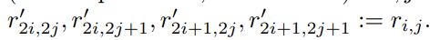{width="4.0472222222222225in"
height="0.32916666666666666in"}Եռանկյունացման ալգորիթմում դինամիկ
քեշավորման դեպքում անհրաժեշտ է ստեղծել նվազագույն չափի քեշ, օրինակ՝
2×2: րբ եռանկյունացման մեջ ավելացվող կետերի թիվը մեծանում է, քեշի չափը
պետք է պարբերաբար կրկնապատկել՝ այսինքն՝ 2×2→4×4→8×և այլն ՝ միաժամանակ
տեղափոխելով տեղեկատվությունը հին քեշից նորի մեջ: Քեշի ընդլայնման ժամանակ
կատարվում են հետևյալ տեղափոխությունները (եթե r հին քեշն է, իսկ r′ նորը).

∀i, j = 0, m − 1

Այս մեթոդը հնարավորություն է տալիս քեշը արդյունավետ օգտագործել և՛ քիչ,
և՛ շատ կետերի դեպքում՝ առանց նախապես իմանալու դրանց ճշգրիտ քանակը։
Դինամիկ քեշի չափը կրկնապատկվում է յուրաքանչյուր անգամ, երբ
եռանկյունացման մեջ ավելացվող կետերի թիվը հասնում է n=r×m^2\ ՝^որտեղ r
--- դինամիկ քեշի աճի գործակիցը, իսկ m --- քեշի ներկայիս չափը։ Իրական
կիրառությունում r-ի արժեքը խորհուրդ է տրվում ընտրել մոտավորապես 3--8:
Եռանկյունացման ալգորիթմների՝ քեշավորմամբ ինչպես և բոլոր իտերատիվ
ալգորիթմներինը, վատագույն դեպքում կազմում է O(N²)**,** իսկ հավասարաչափ
բաշխման դեպքում միջին հաշվով՝ ստատիկ քեշավորման համար՝ O(N ^(9/8^)),
դինամիկ քեշավորման համար՝ O(N) \[1\]: Շատ դեպքերում, երբ սկզբնական
կետերը պատահական կերպով բաշխված են, այս ալգորիթմը գործում է զգալիորեն
ավելի արագ, քան բոլոր մնացած ալգորիթմները \[1\]: Սակայն որոշ իրական
տվյալների համար, որտեղ հաջորդական կետերը գտնվում են միմյանց մոտ (օրինակ՝
ռելիեֆի քարտեզների իզոլինիաների կետերը), դինամիկ քեշավորումը կարող է
պահանջել ավելի շատ ժամանակ, քան այլ ալգորիթմները։Այսպիսի իրավիճակները
հաշվի առնելու համար ալգորիթմին ավելացվում է լրացուցիչ ստուգում․եթե
հերթական ավելացվող կետը գտնվում է նախորդ կետից ավելի քան Δ հեռավորության
վրա (քեշի բջջի ընթացիկ չափի կարգի), որոնումը պետք է սկսվի քեշի մեջ
գտնվող եռանկյունից, հակառակ դեպքում՝ վերջին ստեղծված եռանկյունից։Այս
փոփոխությամբ դինամիկ քեշավորման ալգորիթմը դառնում է առավել արդյունավետ
մեծամասնության իրական տվյալների վրա։

**Իտերատիվ ալգորիթմ՝** **շերտային խտացմամբ**

Իտերատիվ եռանկյունացման ալգորիթմում շերտավոր խտացմամբ անհրաժեշտ է
հարթությունը բաժանել n = (2u + 1) × (2v + 1) նույն չափի պարզ տարրական
քառակուսային բջիջների:  Յուրաքանչյուր քառակուսի համարակալվում է 0-ից
մինչև 2^u^ հորիզոնական և 0-ից մինչև 2^v^ ուղղահայաց կերպով: Այնուհետև
ներմուծվում է շերտ հասկացությունը: Ընդունվում է, որ կետը պատկանում
է i շերտին, եթե նրա քառակուսու երկու համարները բաժանվում են 2^i^-ի
(այդպես բոլոր սկզբնական կետերը կազմում են 0 շերտը, i+1 շերտը կլինի i
շերտի ենթախումբը, իսկ առավելագույն շերտի համարը k = min(u, v)):

1)  i-րդ շերտի բոլոր կետերը՝ ըստ համարների զույգ արժեքների, բաժանվում են
    չորս ենթախմբերի\
    Անկյունային կետեր (նրանց երկու համարները բաժանվում են 2^(i+1)^ -ի) -
    սա i+1-րդ շերտն է;

2)  ներքին կետեր (նրանց երկու համարներն էլ չեն բաժանվում 2^(i+1)^ -ի);

3)  X-սահմանային կետեր (միայն X կոորդինատով համարը բաժանվում է 2^(i+1)^
    -ի);

4)  Y-սահմանային կետեր (միայն Y կոորդինատով համարը բաժանվում է 2^(i+1)^
    -ի):

Կետերի ավելացումը եռանկյունացման մեջ պետք է իրականացնել շերտերով, սկսած
առավելագույն համարով շերտից մինչև զրոյական շերտը: Շերտի ներսում նախ
անհրաժեշտ է ավելացնել երկրորդ տիպի բոլոր կետերը, ապա՝ երրորդ տիպի, և
վերջում՝ չորրորդը: Նկար 25-ում ներկայացված է հարթության բաժանման օրինակ
քառակուսիների, երբ u=3, v=2 և n=7×5, ըստ փուլերի.

(ա) 1-ին շերտի բոլոր կետերը;\
(բ) 0-րդ շերտի ներքին կետերը;\
(գ) 0-րդ շերտի X-սահմանային կետերը;\
(դ) 0-րդ շերտի Y-սահմանային կետերը:

Նկարում 25 թվերը (1-ից սկսած և ավել) ցույց են տալիս քառակուսիների
ընտրության կարգը (և համապատասխանաբար՝ դրանց ներսում գտնվող կետերը)
յուրաքանչյուր փուլում. նախկինում մշակված քառակուսիները նուրբ
ստվերավորված են: Կամայական կետերի բազմությունների դեպքում այս ալգորիթմը
(ինչպես և բոլոր մյուս իտերատիվ ալգորիթմները) ունի O(N²) բարդություն: Եթե
սկզբնական կետերը ունեն հավասարաչափ բաշխում, ապա ալգորիթմի միջին
բարդությունը կլինի O(N): Բացի այդ, \[19\]-ում ցույց է տրվում, որ եթե
սկզբնական կետերը բավարարում են որոշակի ֆիքսված (ոչ հավանական)
սահմանափակումների, ալգորիթմի բարդությունը վատագույն դեպքում նույնպես
O(N) կլինի: Այս ալգորիթմի առավելությունը նաև այն է, որ հանգույցները
եռանկյունացման մեջ միատեսակ և հաջորդաբար ավելացնելով, հաջողվում է
վերացնել երկար նեղ եռանկյունների կառուցման իրավիճակները, որոնք
հետագայում վերակառուցվում են: Դրա շնորհիվ այս ալգորիթմը իրական տվյալների
վրա աշխատում է ավելի արագ, քան շատ այլ ալգորիթմներ:

**Աղյուսակային (բջջային) եռանկյունացման ալգորիթմներ\
«Քայլող խորանարդների» ալգորիթմը**

Առաջին բջջային ալգորիթմը եռանկյունացման միջոցով մակերես կառուցելու համար
առաջարկել է Լորենսենը 1987 թ․-ին \[4\]։ Այս ալգորիթմը տարածության այն
մասը, որտեղ գտնվում է սկզբնական մակերեսը, բաժանում է խորանարդաձև
բջիջների։Այնուհետև յուրաքանչյուր բջիջում, որտեղ մակերեսը հատվում է
խորանարդի հետ, այդ հատումը մոտարկվում է եռանկյուններով։Հարթ հատվածների
վրա հիմնված պատկերի սինթեզի դեպքում, յուրաքանչյուր խորանարդի գագաթները
կլինեն չորս կետ հարակից հատվածների զույգի վրա (յուրաքանչյուր հատվածի
գագաթները կազմում են քառակուսի), որոնք տեղակայված են այնպես, կարծես մեկը
մյուսի վերևում լինեն։ Լորենսենի առաջարկած ալգորիթմը կարելի է բաժանել
երկու փուլերի․

1.  Տարածության G⊂R^3^ բաժանում վերջավոր քանակի բջիջների և այն բջիջների
    որոնում, որոնք հատվում են մակերեսի կողմից։

2.  Մակերեսի մոտարկումը գտնված բջիջներում:

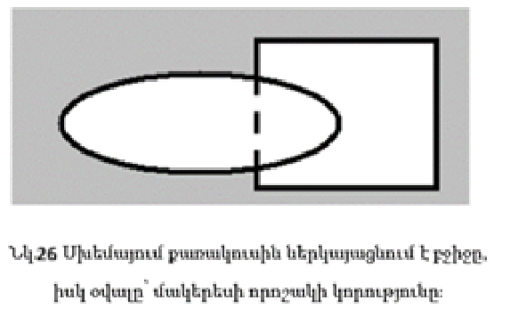{width="2.6114621609798774in"
height="1.6222222222222222in"}Սրանք երկու անկախ ենթախնդիրներ են:
Դիտարկենք դրանք ավելի մանրամասն:\
Առաջին փուլ: Այս փուլի հիմնական խնդիրները հետևյալն են․

1.  Տարածություն G-ն բաժանել բջիջների։

2.  Ընտրել այն բջիջները, որոնք հատվում են որոնվող մակերեսի հետ։

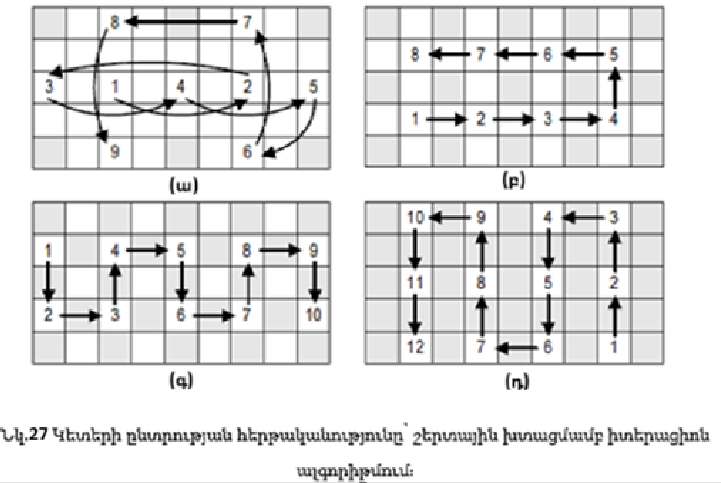{width="3.4784722222222224in"
height="2.311111111111111in"}Այն բանից հետո, երբ G տիրույթը բջիջների
կբաժանվի, մակերեսը սահմանող ֆունկցիայի արժեքները, ընդհանուր դեպքում,
կլինեն հայտնի միայն այդ բջիջների գագաթներում: Այսպիսով տվյալ փուլում,
բջիջը դառնում է հիմնական կառուցվածքային միավորը բոլոր ալգորիթմներում։
Այն խնդիրներում, որտեղ մակերեսը սահմանող ֆունկցիան տրված է աղյուսակի
տեսքով կանոնավոր ցանցի վրա, G տիրույթը բջիջների բաժանելու խնդիրը
անմիջապես վերանում է՝ դրա լուծման եզակիության պատճառով (բջիջը պետք է
լինի զուգահեռանիստ՝ բջջի գագաթներում ֆունկցիայի արժեքները իմանալու
համար)։ Եթե ֆունկցիան տրված է բացահայտ ձևով, ապա բջիջը կարելի է ընտրել
կամայական ձևով և չափով։ Սակայն պետք է հաշվի առնել որոշ խնդիրներ, որոնք
կապված են փնտրվող մակերեսի մոտարկման հետ բջջի ներսում: Եթե բջջի չափը շատ
մեծ է, ապա հնարավոր է ճշգրտության զգալի կորուստ: Ինչպես երևում է 26-րդ
նկարից, եթե բջիջը մեծ չափսի է, ապա որոնվող մակերեսի որոշ հատվածներ
պարզապես չեն երևա։ Սակայն չափազանց փոքր բջիջներ ընտրելն էլ լավ չէ
արագագործության տեսանկյունից։ Հետևաբար, բջիջի չափը պետք է ընտրել ոչ
պակաս, քան որոնվող մակերեսի կառուցման թույլատրելի սխալի սահմանը**։**
«Քայլող խորանարդներ» ալգորիթմում բջջի ձևը զուգահեռապիպեդ է: Սակայն սա
միակ հնարավոր տարբերակը չէ։ Բջիջի ձևն է որոշում, թե ինչպես է կատարվելու
այդ բջիջի եռանկյունացումը։ Ենթադրենք, բջիջը բազմանիստ է՝ N գագաթով։ Այդ
դեպքում յուրաքանչյուր բջիջին համընկնում է N-բիթանոց ինդեքս, որտեղ
յուրաքանչյուր գագաթին համապատասխանում է մեկ բիթ։ Եթե բջիջի գագաթը
գտնվում է որոնվող մակերեսի սահմանափակված ծավալի դուրս, ապա բիթի արժեքը
«0» է, հակառակ դեպքում՝ «1»։  Այդ դեպքում տարբեր տիպի եռանկյունացումների
քանակը կլինի 2N: Ահա թե ինչու, օրինակ, իկոսաեդրը (20-անկյան բազմանիստը)
որպես բջիջ օգտագործելը օպտիմալ չէ։ Ամենափոքր թվով գագաթներով
բազմանիստը եռանկյուն բուրգն է: Հենց այն է օգտագործվում որպես բջիջ
Կանեյրոյի, MT6-ի և Սկալայի ալգորիթմներում: Ենթադրենք, որ տարածությունը G
արդեն բաժանված է բջիջների։ Այդ դեպքում հիմնական խնդիրը դառնում է այն
բջիջների որոնումը, որոնք հատվում են որոնվող մակերեսի հետ: Ենթադրենք, C-ն
բջիջների բազմություն է: Այդ դեպքում Cv-ն կլինի F(P) = v մակերեսով հատվող
բջիջների բազմությունը։ Կարելի է համարել, որ մակերեսը հատում է բջիջը, եթե
գոյություն ունեն այդ բջիջի երկու գագաթներ p~1~ և p~2~ ​, այնպես, որ

> F(p~1~) \< v \< F(p~2~) (2.2)

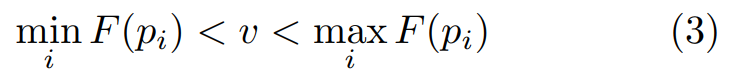{width="2.85in" height="0.31527777777777777in"}Այս
պայմանը բավարարվում է, եթե ճիշտ է անհավասարությունը.

> (2.3)

որտեղ p~i~, p~j~-ն բջջի գագաթներն են:

Այսպիսով, խնդիրը հանգեցվեց հետևյալին. բջիջների C բազմությունից
ընտրել C~v~ ենթաբազմությունը, որի բջիջները բավարարում են (2.3) պայմանը:
Հիմա դիտարկենք մակերեսի մոտարկման խնդիրը բջջի ներսում:

Երկրորդ փուլ։

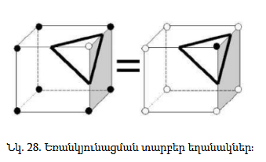{width="2.398520341207349in"
height="1.4645833333333333in"}Ինչպես արդեն ասվեց, տարածքը բաժանվում է
բջիջների, և ընտրվում են միայն այն բջիջները, որտեղ պետք է կատարել
մոտարկում։ Այսպիսով, երկրորդ փուլի խնդիրն է մակերեսի մոտարկումը մեկ բջջի
ներսում։ Ամենաօպտիմալ մոտարկման եղանակը եռանկյունացումն է: Հաշվենք, թե
քանի եղանակով կարելի է եռանկյունացնել մի պարանելեպիպեդ։ Ենթադրենք ունենք
8-բիթանոց ինդեքս։ Յուրաքանչյուր գագաթի կհամապատասխանեցնենք ինդեքսում մեկ
բիթ: Ընդ որում, եթե բջջի գագաթը գտնվում է փնտրվող մակերեսով
սահմանափակված ծավալից դուրս, ապա այդ բիթի արժեքը «0» է, հակառակ դեպքում՝
«1»: Այդ դեպքում տարբեր տիպի եռանկյունացումների քանակը կլինի 2⁸ = 256:
Սակայն, ինչպես երևում է նկար 28-ից, (i) ինդեքսով եռանկյունացման եղանակը
համընկնում է (i ≠ j) ինդեքսով եռանկյունացման եղանակի հետ: Արդյունքում
մնում է 128 տարբերակ։Բայց եթե հաշվի առնենք նաև սիմետրիան ու պտույտները,
ապա այդ 128-ը կարելի է բերել ընդամենը 15 տարբերակի (նկար 29)։ Ստանալով
եռանկյունացման եղանակը, արդեն կարելի է մոտարկել մակերեսը բջջի ներսում:
Այս պահին արդեն հայտնի է՝ քանի եռանկյուն է պետք, և յուրաքանչյուր
եռանկյան համար հայտնի են բջջի այն կողերը, որոնց վրա գտնվում են
գագաթները։Մնում է գտնել այն կետը կողի վրա, որտեղ մակերեսը հատում է այդ
կողը։ Եթե մակերեսը տրված է հստակ ֆունկցիայով, ապա այդ կետը կարելի է մեծ
ճշտությամբ գտնել արմատի որոնման մեթոդներով։ Եթե ֆունկցիան տրված է
աղյուսակով (թվային ցանցի վրա), ապա այդ կետը
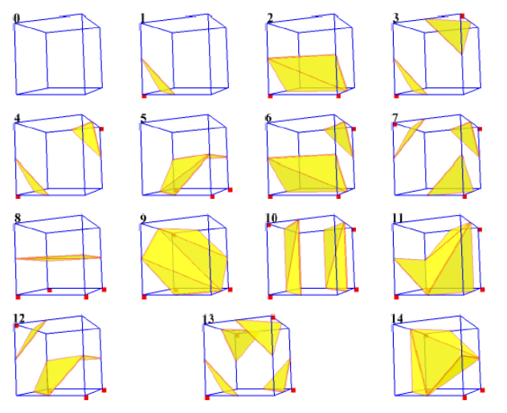{width="3.3916666666666666in"
height="2.767361111111111in"}գտնում են գծային ինտերպոլացիայով՝ ըստ կողի
երկու գագաթների արժեքների։

> Նկ. 29. Եռանկյունացման եղանակներ։

**Կանեյրոյի ալգորիթմ**

Կանեյրոյի կողմից առաջարկված ալգորիթմը (հայտնի է նաև որպես «Քայլող
տետրաեդրեր 5») հիմնված է տարածությունը եռանկյունաձև բուրգերի բաժանելու
վրա և, ինչպես «Քայլող խորանարդների» ալգորիթմը, բաղկացած է երկու փուլից․

1.  Տարածության բաժանում վերջավոր թվով բջիջների և այն բջիջների որոնում,
    որոնք հատվում են որոնվող մակերեսով։

2.  Մակերևույթի մոտարկումը գտնված բջիջներում:

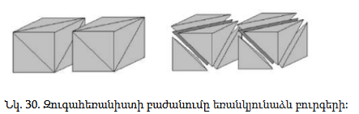{width="2.966666666666667in"
height="0.94375in"}Առաջին փուլ:

Ինչպես արդեն նշվեց, ալգորիթմը բջիջների դերերում օգտագործում է
եռանկյունաձև բուրգեր։Դրա համար տարածությունը բաժանվում է զուգահեռանիստը՝
համաձայն այն ցանցի, որի վրա տրված է ֆունկցիան, ապա յուրաքանչյուր
զուգահեռանիստը բաժանվում է եռանկյունաձև բուրգերի։Նման մոտեցում կիրառվում
է նաև Սկալայի ալգորիթմներում։ Զուգահեռանիստը բաժանումը եռանկյունաձև
բուրգերի՝ Կանեյրոյի մեթոդով, ցուցադրված է 30-րդ նկարում։Այնուամենայնիվ,
նման բաժանման դեպքում «հատվածների կարերը» չեն համընկնում։Այլ կերպ ասած,
հարևան բջիջների եռանկյունացման արդյունքում ստացված եռանկյունների կողմերը
չեն համընկնի, ինչը կհանգեցնի «անցքերի» առաջացման: Այս խնդիրը լուծելու
համար առաջարկվում է զուգահեռանիստը բաժանել «շախմատային կարգով» , այն է՝
հերթով փոխելով բաժանման ձևանմուշը․ այն, որը ցույց է տրված 30-րդ նկարում,
հաջորդ բջիջի համար փոխարինվում է հայելային ձևանմուշով, ինչպես ցույց է
տրված 31-րդ նկարում։

Երկրորդ փուլ:

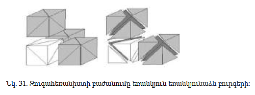{width="3.466666666666667in"
height="1.3in"}Երկրորդ փուլի խնդիրն է մակերեսի մոտարկումը բջջի
ներսում: Կանեյրոյի և Սկալայի ալգորիթմների համար երկրորդ փուլը նույնն է․
կատարվում է եռանկյունաձև բուրգի եռանկյունացում՝ համաձայն ֆունկցիայի
արժեքների բուրգի գագաթներում։ Հաշվենք եռանկյունաձև բուրգի եռանկյունացման
հնարավոր եղանակների քանակը։ Ենթադրենք, ունենք 4-բիթանոց ինդեքս:
Յուրաքանչյուր գագաթին համապատասխանենք մեկ բիթ ինդեքսում՝ նույն կերպ,
ինչպես զուգահեռափիպեդի դեպքում։  Այդ դեպքում տարբեր տիպի
եռանկյունացումների քանակը կլինի 2⁴ = 16: Սակայն, օգտագործելով սիմետրիա և
պտույտ, հնարավոր եղանակների քանակը կարելի է նվազեցնել մինչև 3 (32-րդ
նկար)։

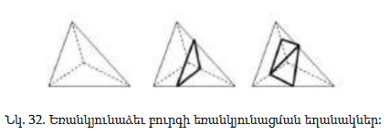{width="3.550307305336833in"
height="1.2334405074365704in"}**\
\
\
**

4.  **Քայլող խորանարդների» ալգորիթմի կիրառումը մի շարք կիրառական
    խնդիրներ լուծելու համար**

**Խնդիր 1 .\
** Իրականացնել եռաչափ մակերևույթի եռանկյունացում\
$f(x,y,z) = \ \frac{x^{2}}{2} + \frac{y^{2}}{3} + \frac{z^{2}}{4} - 15 = 0$
անբացահայտ ֆունկցիայի հիման վրա՝ կիրառելով «Քայլող խորանարդների»
ալգորիթմը:

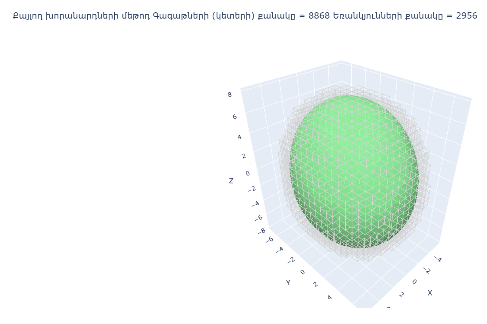{width="6.138194444444444in"
height="4.034027777777778in"}

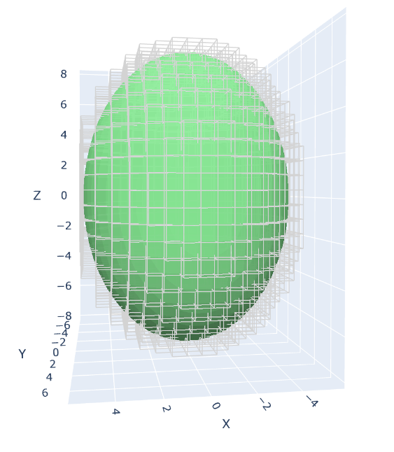{width="2.464583333333333in"
height="2.827777777777778in"}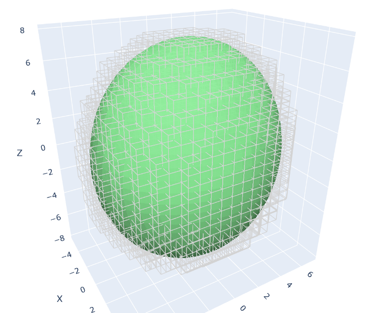{width="3.5756944444444443in"
height="3.0083333333333333in"}

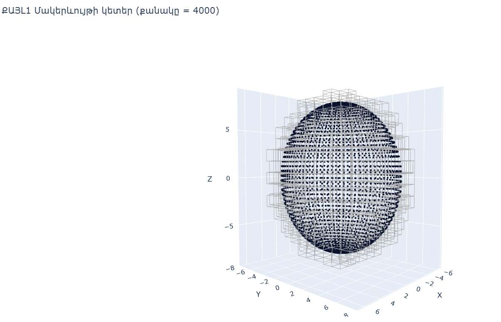{width="6.69375in"
height="4.3069444444444445in"}**Խնդիր 2 .\
**Իրականացնել եռաչափ մակերևույթի եռանկյունացում\
$f(x,y,z) = \ \frac{x^{2}}{2} + \frac{y^{2}}{3} + \frac{z^{2}}{4} - 15$
անբացահատ ֆունկցիայի հիման վրա՝ կիրառելով «Քայլող խորանարդների» և
Դելոնեյի եռանկյունացման ալգորիթմները:

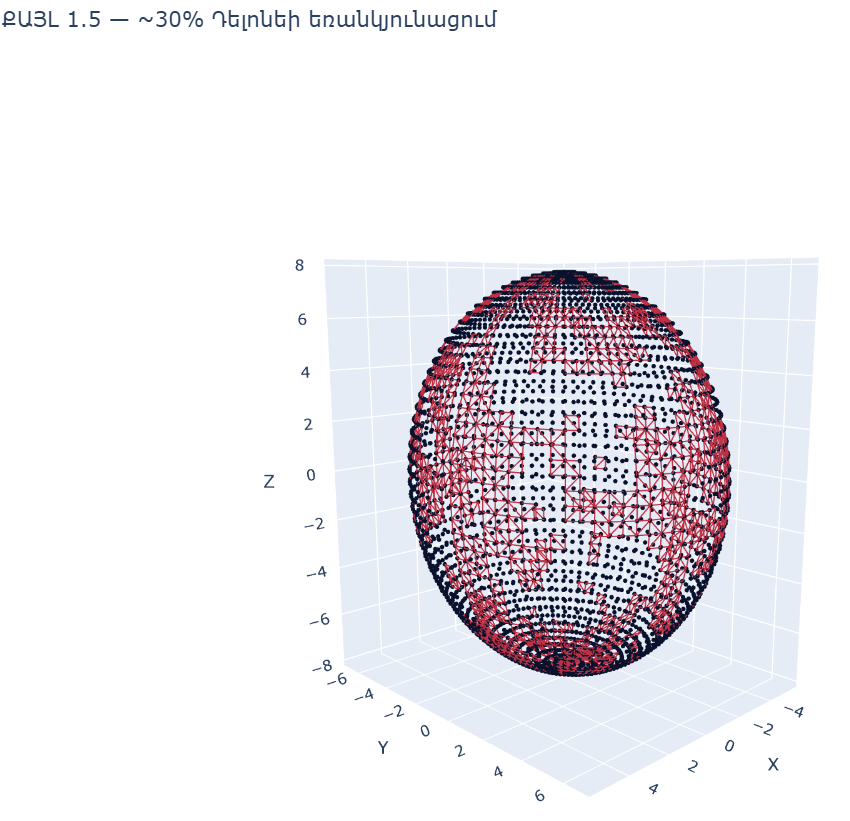{width="4.645833333333333in" height="4.18125in"}

{width="5.8381944444444445in"
height="3.6284722222222223in"}

{width="6.375in" height="4.272916666666666in"}

{width="3.03125in" height="2.651388888888889in"}

{width="3.4281692913385826in"
height="2.239922353455818in"}Էլիպսոիդի լոկալ հատվածի եռանկյունացումը՝
կիրառված Դելոնեյի եռանկյունացուման իմպլիմենտացիան:

{width="3.0083333333333333in"
height="2.8604166666666666in"}

Հատվածի կետերի քանակը = 225

Ձեռքով ստացված եռանկյունների քանակը = 392

{width="3.2069444444444444in"
height="2.251388888888889in"}

{width="3.2993055555555557in"
height="2.328472222222222in"}{width="3.3541666666666665in"
height="2.4944444444444445in"}

{width="3.0965277777777778in"
height="2.720138888888889in"}{width="3.1458333333333335in"
height="2.8652777777777776in"}

**Խնդիր 3 .\
**Իրականացնել անատոմիական կառուցվածքների (մարդու ձեռքի ոսկորների) եռաչափ
եռանկյունացում՝ հիմնվելով STEP ֆորմատի ինժեներական ֆայլի տվյալների վրա:
Կիրառել«Քայլող խորանարդների» և Դելոնեյի եռանկյունացման ալգորիթմները:

Գագաթների (կետերի) քանակը = 47874

{width="4.253215223097113in"
height="4.351189851268591in"} Եռանկյունների քանակը = 15958

**\
**

{width="3.6680555555555556in"
height="3.5096970691163603in"}

{width="4.767361111111111in"
height="4.358333333333333in"}

{width="5.5508213035870515in"
height="4.0472222222222225in"}

{width="2.082638888888889in"
height="4.0in"}{width="1.8777777777777778in"
height="3.7736111111111112in"}ձախ բազկոսկր ձախ ծղիկոսկր

> ձախ ճաճանչոսկր

{width="2.8854166666666665in"
height="4.773611111111111in"}
